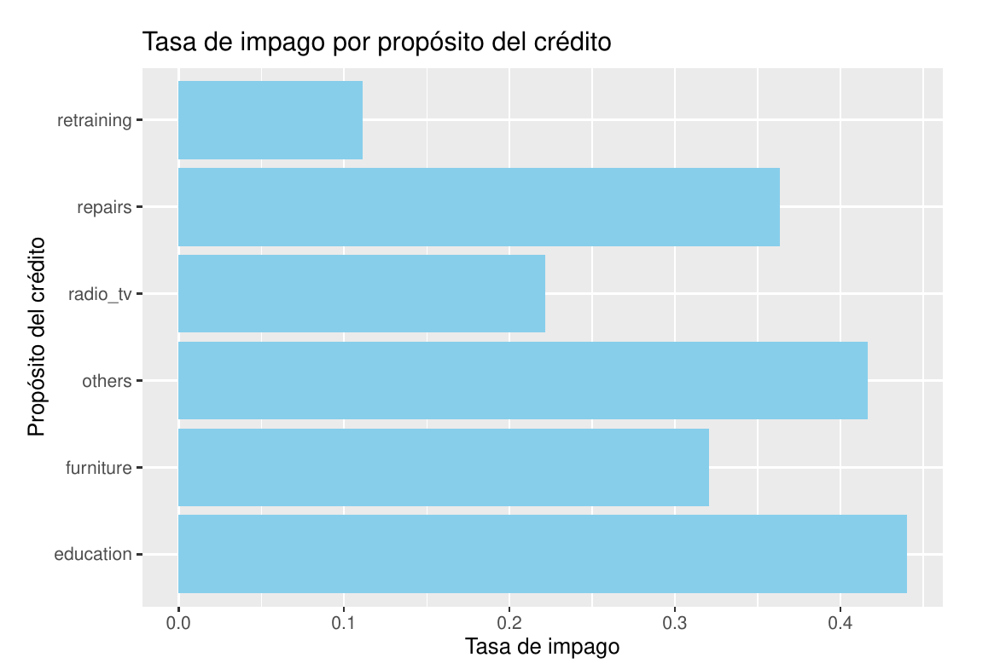

# Bankruptcy Prediction with Decision Trees

## 📄 Project Overview

This project implements a machine learning solution to predict corporate bankruptcy using financial data. The core of this project is a Decision Tree classifier, a powerful and interpretable model, trained to distinguish between healthy and bankrupt companies.

The goal is to build a reliable predictive model that can serve as an early warning system for financial distress, demonstrating a practical application of machine learning in risk management and financial analysis. The entire workflow, from data exploration to model evaluation, is documented in the accompanying Jupyter Notebook.

## ✨ Key Features

*   **Exploratory Data Analysis (EDA):** A thorough investigation of the dataset to understand feature distributions and relationships between financial metrics and the target variable (bankruptcy).
*   **Data Preprocessing:** Preparing the data for modeling, including handling missing values and splitting the data into training and testing sets.
*   **Model Training:** Building and training a Decision Tree Classifier using Scikit-learn.
*   **Hyperparameter Tuning:** Optimizing the Decision Tree model's parameters to improve performance and prevent overfitting.
*   **Performance Evaluation:** Assessing the model's accuracy, precision, recall, and F1-score, and visualizing the results with a confusion matrix and classification report.

## 📊 Dataset

The project utilizes the `Bankrupcy_data.csv` dataset. It contains various financial ratios and metrics from a collection of companies, with a binary target variable indicating whether a company went bankrupt or not.

- **Target Variable:** `Bankrupt?` (1 for bankrupt, 0 for healthy)
- **Features:** Includes metrics such as return on equity, debt ratio, and other financial indicators.

## 💻 Technologies Used

*   **Language:** Python 3
*   **Libraries:**
    *   Pandas & NumPy (for data handling and numerical operations)
    *   Matplotlib & Seaborn (for data visualization)
    *   Scikit-learn (for machine learning model implementation and evaluation)
    *   Jupyter Notebook (as the development environment)

## 🚀 Getting Started

### Prerequisites

*   Python 3.8 or newer
*   Jupyter Notebook or JupyterLab
*   Git

### Installation and Usage

1.  **Clone the repository:**
    ```bash
    git clone https://github.com/Kamaranis/Classification-with-decision-trees.git
    cd Classification-with-decision-trees
    ```
2.  **Install the necessary libraries:**
    For best practice, create a virtual environment first.
    ```bash
    pip install pandas numpy scikit-learn matplotlib seaborn jupyter
    ```
3.  **Launch Jupyter Notebook:**
    ```bash
    jupyter notebook
    ```
4.  **Run the analysis:**
    Open the `Decision Tree.ipynb` file and execute the cells in order to see the full analysis, model training process, and results.

## 📈 Results Showcase

  
Figure 1: *Credit type and number of non-payments*

  
Figure 2: *Default rate by credit purpose*

**Final Model Performance:**


**Confusion Matrix:**

  
Figure 3: *Confusion matrix I*

  
Figure 4: *Confusion matrix II*
_

## 👤 Author

**Antonio Barrera Mora**

*   **LinkedIn:** https://www.linkedin.com/in/anbamo/
*   **GitHub:** @Kamaranis