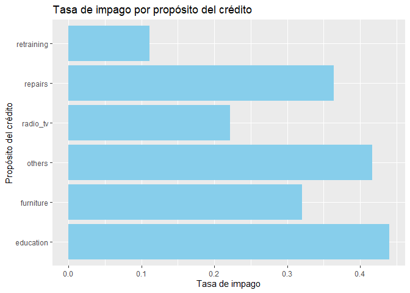
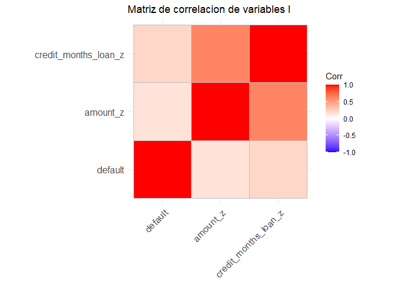
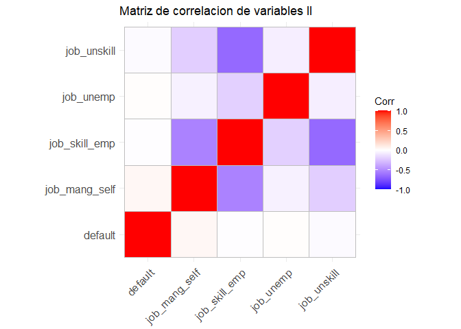
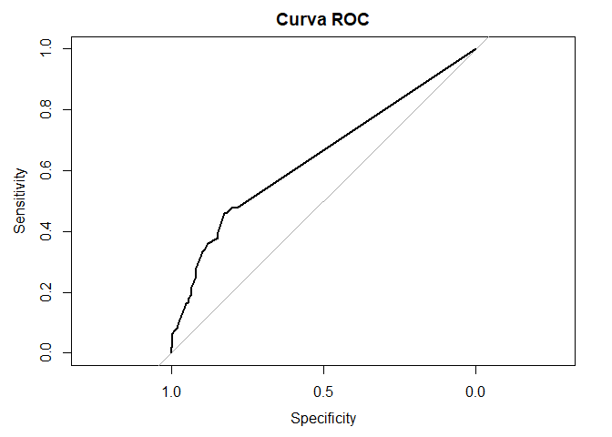

Classification with decision trees
================
Anton Barrera Mora (<me@antonio-barrera.cyou>)
June 2023

# Introduction

We will address the creation of a supervised data mining project. We
will use a classification algorithm, specifically the decision tree
model. We will rely on the ‘German Credit’ dataset from “UCI Machine
Learning Repository: Statlog (German Credit Data) Data Set” (n.d.) as
our reference. We will consider the ‘default’ variable as an indicator
and label for credit defaults. This is a classification problem because
the outcome is a discrete variable: whether credits are paid or not,
with only two classes.

Decision trees and random forests can be employed for this type of
classification problem, as well as for supervised regression problems.
They can handle non-linear relationships and interactions between
variables well, helping to understand which factors are driving the
outcomes, in this case, the factors present in credit defaults.

# Phase 1: Understanding the Business

## Problem:

The requirement is to have the ability to predict which customers, based
on certain variables, may default on credit in case of granting a loan.

## Data Collection:

We will base the project on the “[Statlog (German Credit Data) Data
Set](https://archive.ics.uci.edu/ml/datasets/statlog+(german+credit+data)).”
The dataset from the year 1994 classifies individuals described by a set
of attributes to determine if they are a good or bad credit risk. It
contains a total of 1000 records with around 20 variables, presented in
two formats, one of which is numeric only, including a cost matrix. This
dataset is publicly available. Additionally, the dataset is accompanied
by[documentatio](https://archive.ics.uci.edu/ml/machine-learning-databases/statlog/german/german.doc)n
that explains the different attributes.

# Phase 2: Understanding the Data

## Initial Analysis

We start the work by conducting an analysis of the data and the
different variables present in the dataset. This initial exploration
will give us insights into the structure of the dataset, the types of
variables present, and an overview of their distribution and summary
statistics.

### Exploring the dataset

Loading the dataset:

``` r
credit <- read.csv("credit.csv", header=T,sep = ",")
attach(credit) # Agregamos el fichero al entorno de trabajo para poder llamar a las variables mas facilmente, aunque este metodo tiene varios problemas
```

We will take a first look at the data to see what variables are present:

``` r
# Observamos la informacion de las variables

glimpse(credit)
```

    ## Rows: 1,000
    ## Columns: 21
    ## $ checking_balance     <chr> "< 0 DM", "1 - 200 DM", "unknown", "< 0 DM", "< 0…
    ## $ months_loan_duration <int> 6, 48, 12, 42, 24, 36, 24, 36, 12, 30, 12, 48, 12…
    ## $ credit_history       <chr> "critical", "repaid", "critical", "repaid", "dela…
    ## $ purpose              <chr> "radio/tv", "radio/tv", "education", "furniture",…
    ## $ amount               <int> 1169, 5951, 2096, 7882, 4870, 9055, 2835, 6948, 3…
    ## $ savings_balance      <chr> "unknown", "< 100 DM", "< 100 DM", "< 100 DM", "<…
    ## $ employment_length    <chr> "> 7 yrs", "1 - 4 yrs", "4 - 7 yrs", "4 - 7 yrs",…
    ## $ installment_rate     <int> 4, 2, 2, 2, 3, 2, 3, 2, 2, 4, 3, 3, 1, 4, 2, 4, 4…
    ## $ personal_status      <chr> "single male", "female", "single male", "single m…
    ## $ other_debtors        <chr> "none", "none", "none", "guarantor", "none", "non…
    ## $ residence_history    <int> 4, 2, 3, 4, 4, 4, 4, 2, 4, 2, 1, 4, 1, 4, 4, 2, 4…
    ## $ property             <chr> "real estate", "real estate", "real estate", "bui…
    ## $ age                  <int> 67, 22, 49, 45, 53, 35, 53, 35, 61, 28, 25, 24, 2…
    ## $ installment_plan     <chr> "none", "none", "none", "none", "none", "none", "…
    ## $ housing              <chr> "own", "own", "own", "for free", "for free", "for…
    ## $ existing_credits     <int> 2, 1, 1, 1, 2, 1, 1, 1, 1, 2, 1, 1, 1, 2, 1, 1, 2…
    ## $ default              <int> 1, 2, 1, 1, 2, 1, 1, 1, 1, 2, 2, 2, 1, 2, 1, 2, 1…
    ## $ dependents           <int> 1, 1, 2, 2, 2, 2, 1, 1, 1, 1, 1, 1, 1, 1, 1, 1, 1…
    ## $ telephone            <chr> "yes", "none", "none", "none", "none", "yes", "no…
    ## $ foreign_worker       <chr> "yes", "yes", "yes", "yes", "yes", "yes", "yes", …
    ## $ job                  <chr> "skilled employee", "skilled employee", "unskille…

We can see that there are a large number of categorical variables. We
proceed with a detailed analysis:

#### Description of attributes or variables:

- Checking_balance \<chr\>. It refers to the status of the checking
  account for the loan in Deutsche Mark (DM). It is a categorical
  variable with four possible categories:

  - Less than 0 DM

  - Between 0 and 200 DM

  - More than 200 DM or salary has been deposited into this account for
    at least 1 year

  - No checking account

Although decision trees can handle categorical variables, in this case,
we will convert it into dummy variables based on whether there is a
balance or not in order to make the model easier to interpret.

- months_loan_duration \<int\>. It refers to the duration of the loan
  repayment in months. It is a numerical variable with a wide range. In
  this case, we will scale the variable.

- credit_history \<chr\>. It is a categorical variable that describes
  the credit history of the loan applicant. It does not require
  transformation, but we will recode the levels.

- purpose \<chr\>. This variable answers the question: What is the
  purpose of the credit application? It is another categorical variable.
  In this case, we will convert it into a dummy variable that answers
  the question: Is it for leisure? Where 0 is false and 1 is true.

- amount \<int\>. The granted credit amount. The range of values is very
  wide, so we will normalize the variable to ensure that the attributes
  have a similar range of values.

- savings_balance \<chr\>. It refers to the amount in a savings account,
  distinguishing it from a checking account. Like attribute 1, it may be
  important for predicting whether someone will default on a loan or
  have difficulties with loan repayments. We will use the same strategy
  as attribute 1.

- employment_length \<chr\>. This attribute refers to the length of
  employment in the current job. It is an ordinal variable. We will
  encode the categories as integers.

- installment_rate \<int\>. It refers to the percentage of disposable
  income that is allocated to loan installments. The dataset authors
  define this attribute as “Installment rate in percentage of disposable
  income”. It takes values from 1 to 4, which seem to indicate ranges or
  categories instead of literal percentages. We understand that 1
  represents a low percentage of disposable income allocated to loan
  installments, and 4 represents a high percentage of disposable income
  available for loan installments. Therefore, a higher value in
  “installment_rate” indicates a higher percentage of disposable income
  dedicated to loan installments, which could increase the risk of
  default if financial difficulties arise. We will keep the values as
  they are.

- personal_status \<chr\>. It refers to marital status. There is a risk
  of gender bias here, as it is scientifically questionable and
  ethically reproachable to assume that women or men are of a certain
  creditworthy nature based on their gender. This variable presents many
  ethical problems, and we will choose to exclude it.

- other_debtors \<chr\>. Other debtors refer to the presence of
  guarantors. We will recode the levels.

- residence_history \<int\>. Reviewing the dataset documentation, we
  observe that it refers to the length of time the person has been
  residing in the current residence. It is not very relevant considering
  that attribute number 14 refers to the aspect of property ownership of
  the residence. Therefore, we will choose not to consider it.

- property \<chr\>. It refers to the types of property owned by the loan
  borrower. It has specific categories such as real estate, building
  society savings agreement/life insurance, car or other, and unknown/no
  property. It is a categorical variable. We are interested in the
  differences between customers who have different properties, so we
  will create dummy variables for each property type.

- age \<int\>. Age is a numerical variable. Classifying individuals
  based on their age is clearly unethical and discriminatory, so we will
  exclude this variable from the dataset.

- installment_plan \<chr\>. It refers to the existence of other
  installment plans or loans that the credit applicant may have, in
  addition to the loan being applied for. Originally, it refers to
  whether it is with a bank, a store, or no installment plan. In this
  case, we will convert it into a new dummy variable.

- housing \<chr\>. It refers to the type of housing and its ownership.
  In this case, we will create dummy variables for each category.

- existing_credits \<int\>. This attribute refers to the number of
  credits the person has with the bank. This attribute raises serious
  doubts since there is already a similar attribute (14). The
  documentation does not clarify whether it refers to a credit already
  paid or in progress. We choose to keep it because the formulation of
  the attribute name is in the present tense, so we assume that they are
  credits already requested, in progress, and pending payment. We will
  keep the values as they are.

- default \<int\>. The target variable. It is encoded as 1 or 2. We will
  modify it to 0 and 1.

- telephone \<chr\>. Whether the client has a telephone installed or not
  can be an independent variable to consider when assessing economic
  capacity. We will convert it into another dummy variable, although in
  the present day, the possession of a telephone in a household may not
  be very representative of its economic potential.

- foreign_worker \<chr\>. It refers to whether the client who enjoyed
  the credit was a foreign worker or not. The inclusion of certain
  characteristics, such as nationality, race, gender, religion, sexual
  orientation, among others, in credit decision models has been the
  subject of significant ethical and legal debate. This is a case
  specific to the German society model, where this variabl may have made
  sense in its time. From a legal perspective, legislation varies
  depending on the country. In the United States, the “**Equal Credit
  Opportunity Act**” prohibits discrimination in any aspect of a credit
  transaction based on race, color, religion, national origin, sex,
  marital status, age, among others. The ethics are questionable, so we
  will choose to remove it from the model.

- dependents \<int\>. It refers to the number of dependents the client
  has. We choose to keep it in its current integer format.

- job \<chr\>. Skilled worker or not. It contains categories related to
  the legal status of the worker in the country. We will create dummy
  variables for each category.

At this point, we would like to clarify several ethical aspects that
arise from the data. The inclusion of many of the variables present -
Age, Worker’s origin, Marital status, Gender - borders on illegality -
if not directly - according to current legislation in many parts of the
world. They are clearly deserving of ethical considerations. We have
chosen not to include them. In this case, it is a work for educational
purposes, but in a real-life scenario, we would refuse to include this
type of characteristics that only serve to bias and support
discriminatory policies.

We continue the analysis in search of ‘NA’ values and the distribution
of the variables:

``` r
#Buscamos NA y estudiar la distribucion de las variables
summary(credit)
```

    ##  checking_balance   months_loan_duration credit_history       purpose         
    ##  Length:1000        Min.   : 4.0         Length:1000        Length:1000       
    ##  Class :character   1st Qu.:12.0         Class :character   Class :character  
    ##  Mode  :character   Median :18.0         Mode  :character   Mode  :character  
    ##                     Mean   :20.9                                              
    ##                     3rd Qu.:24.0                                              
    ##                     Max.   :72.0                                              
    ##      amount      savings_balance    employment_length  installment_rate
    ##  Min.   :  250   Length:1000        Length:1000        Min.   :1.000   
    ##  1st Qu.: 1366   Class :character   Class :character   1st Qu.:2.000   
    ##  Median : 2320   Mode  :character   Mode  :character   Median :3.000   
    ##  Mean   : 3271                                         Mean   :2.973   
    ##  3rd Qu.: 3972                                         3rd Qu.:4.000   
    ##  Max.   :18424                                         Max.   :4.000   
    ##  personal_status    other_debtors      residence_history   property        
    ##  Length:1000        Length:1000        Min.   :1.000     Length:1000       
    ##  Class :character   Class :character   1st Qu.:2.000     Class :character  
    ##  Mode  :character   Mode  :character   Median :3.000     Mode  :character  
    ##                                        Mean   :2.845                       
    ##                                        3rd Qu.:4.000                       
    ##                                        Max.   :4.000                       
    ##       age        installment_plan     housing          existing_credits
    ##  Min.   :19.00   Length:1000        Length:1000        Min.   :1.000   
    ##  1st Qu.:27.00   Class :character   Class :character   1st Qu.:1.000   
    ##  Median :33.00   Mode  :character   Mode  :character   Median :1.000   
    ##  Mean   :35.55                                         Mean   :1.407   
    ##  3rd Qu.:42.00                                         3rd Qu.:2.000   
    ##  Max.   :75.00                                         Max.   :4.000   
    ##     default      dependents     telephone         foreign_worker    
    ##  Min.   :1.0   Min.   :1.000   Length:1000        Length:1000       
    ##  1st Qu.:1.0   1st Qu.:1.000   Class :character   Class :character  
    ##  Median :1.0   Median :1.000   Mode  :character   Mode  :character  
    ##  Mean   :1.3   Mean   :1.155                                        
    ##  3rd Qu.:2.0   3rd Qu.:1.000                                        
    ##  Max.   :2.0   Max.   :2.000                                        
    ##      job           
    ##  Length:1000       
    ##  Class :character  
    ##  Mode  :character  
    ##                    
    ##                    
    ## 

``` r
perdidos <-credit[is.na(credit),]
print(perdidos)
```

    ##  [1] checking_balance     months_loan_duration credit_history      
    ##  [4] purpose              amount               savings_balance     
    ##  [7] employment_length    installment_rate     personal_status     
    ## [10] other_debtors        residence_history    property            
    ## [13] age                  installment_plan     housing             
    ## [16] existing_credits     default              dependents          
    ## [19] telephone            foreign_worker       job                 
    ## <0 rows> (or 0-length row.names)

We observe the characteristics and how the variables are distributed. At
this point, it is interesting to highlight some information such as:

- The loan duration is centered around an average of 18 months.

- The granted amounts revolve around an average of 3271 DM.

- On average, customers had only one credit with the institution.

- And, regarding the customer prototype, they tend to have a dependent
  family member.

We ensure that there are no blank values.

``` r
# Encuentra filas con al menos un blanco
blank_rows <- rowSums(credit == "") > 0

# Imprime las filas con al menos un blanco
print("Blancos")
```

    ## [1] "Blancos"

``` r
print(credit[blank_rows, ])
```

    ##  [1] checking_balance     months_loan_duration credit_history      
    ##  [4] purpose              amount               savings_balance     
    ##  [7] employment_length    installment_rate     personal_status     
    ## [10] other_debtors        residence_history    property            
    ## [13] age                  installment_plan     housing             
    ## [16] existing_credits     default              dependents          
    ## [19] telephone            foreign_worker       job                 
    ## <0 rows> (or 0-length row.names)

``` r
# Observamos las dimensiones del dataset (debe ser 1000 / 21)
dim(credit)
```

    ## [1] 1000   21

We can confidently state that the dataset does not have any infinite or
blank values. However, as part of the data preparation process, we will
need to remove and transform variables as previously mentioned.

## Dataset preparation

We will exclude attributes that we are not considering, such as marital
status, residence history, age, and foreign worker status.

1.  We will exclude attributes that we will not consider such as marital
    status, length of residence, age and whether you are a foreign
    worker:

``` r
# Eliminamos las columnas

credit <- select(credit, -c(personal_status, residence_history, age, foreign_worker))
```

2.  We are going to convert checking_balance\<chr\> into a dummie. The
    current account balance can be a relevant information when it comes
    to whether defaults occur or not, so we are interested in generating
    dummie variables for each category:

``` r
# Antes que nada, convertimos el atributo en factor:
credit$checking_balance <- as.factor(credit$checking_balance)

# Convertimos la variable 'checking_balance' en variables dummy
dummy_vars <- model.matrix(~checking_balance -1, data = credit)

#Convertimos el resultado en df y asignamos nombres a las columnas apropiadas
dummy_df <- as.data.frame(dummy_vars)
dummy_df[] <- lapply(dummy_df, as.integer) # tiene la fea costumbre de convertir a dbl, rectificamos a int 
colnames(dummy_df) <- levels(credit$checking_balance)

# Forzamos el nombre que a nosotros nos interesa, mas descriptivo:
names(dummy_df) <- c("checking_balance_lt_0", "checking_balance_gt_200", "checking_balance_1_200", "checking_balance_unknown")


# Unimos las nuevas variables al df original
credit <- cbind(credit, dummy_df)

# Excluimos el atributo 'checking_balance':
credit$checking_balance <- NULL

# visualizamos el dataset o df:
str(credit)
```

    ## 'data.frame':    1000 obs. of  20 variables:
    ##  $ months_loan_duration    : int  6 48 12 42 24 36 24 36 12 30 ...
    ##  $ credit_history          : chr  "critical" "repaid" "critical" "repaid" ...
    ##  $ purpose                 : chr  "radio/tv" "radio/tv" "education" "furniture" ...
    ##  $ amount                  : int  1169 5951 2096 7882 4870 9055 2835 6948 3059 5234 ...
    ##  $ savings_balance         : chr  "unknown" "< 100 DM" "< 100 DM" "< 100 DM" ...
    ##  $ employment_length       : chr  "> 7 yrs" "1 - 4 yrs" "4 - 7 yrs" "4 - 7 yrs" ...
    ##  $ installment_rate        : int  4 2 2 2 3 2 3 2 2 4 ...
    ##  $ other_debtors           : chr  "none" "none" "none" "guarantor" ...
    ##  $ property                : chr  "real estate" "real estate" "real estate" "building society savings" ...
    ##  $ installment_plan        : chr  "none" "none" "none" "none" ...
    ##  $ housing                 : chr  "own" "own" "own" "for free" ...
    ##  $ existing_credits        : int  2 1 1 1 2 1 1 1 1 2 ...
    ##  $ default                 : int  1 2 1 1 2 1 1 1 1 2 ...
    ##  $ dependents              : int  1 1 2 2 2 2 1 1 1 1 ...
    ##  $ telephone               : chr  "yes" "none" "none" "none" ...
    ##  $ job                     : chr  "skilled employee" "skilled employee" "unskilled resident" "skilled employee" ...
    ##  $ checking_balance_lt_0   : int  1 0 0 1 1 0 0 0 0 0 ...
    ##  $ checking_balance_gt_200 : int  0 0 0 0 0 0 0 0 0 0 ...
    ##  $ checking_balance_1_200  : int  0 1 0 0 0 0 0 1 0 1 ...
    ##  $ checking_balance_unknown: int  0 0 1 0 0 1 1 0 1 0 ...

``` r
names(credit)
```

    ##  [1] "months_loan_duration"     "credit_history"          
    ##  [3] "purpose"                  "amount"                  
    ##  [5] "savings_balance"          "employment_length"       
    ##  [7] "installment_rate"         "other_debtors"           
    ##  [9] "property"                 "installment_plan"        
    ## [11] "housing"                  "existing_credits"        
    ## [13] "default"                  "dependents"              
    ## [15] "telephone"                "job"                     
    ## [17] "checking_balance_lt_0"    "checking_balance_gt_200" 
    ## [19] "checking_balance_1_200"   "checking_balance_unknown"

And we check that the changes have been made correctly.

3.  months_loan_duration\<int\>. The expected amortisation of the loan
    in months. We will scale the variable:

``` r
#Escalamos la variable months_loan_duration
credit_months_loan_z <- scale(credit$months_loan_duration)

# Unimos las nuevas variables al df original
credit <- cbind(credit, credit_months_loan_z)

# Renombramos
# credit <- credit %>% rename(credit_scale_z = credit_escale)

# Excluimos el atributo 'months_loan_duration':
credit$months_loan_duration <- NULL

# Visualizamos la tabla
glimpse(credit)
```

    ## Rows: 1,000
    ## Columns: 20
    ## $ credit_history           <chr> "critical", "repaid", "critical", "repaid", "…
    ## $ purpose                  <chr> "radio/tv", "radio/tv", "education", "furnitu…
    ## $ amount                   <int> 1169, 5951, 2096, 7882, 4870, 9055, 2835, 694…
    ## $ savings_balance          <chr> "unknown", "< 100 DM", "< 100 DM", "< 100 DM"…
    ## $ employment_length        <chr> "> 7 yrs", "1 - 4 yrs", "4 - 7 yrs", "4 - 7 y…
    ## $ installment_rate         <int> 4, 2, 2, 2, 3, 2, 3, 2, 2, 4, 3, 3, 1, 4, 2, …
    ## $ other_debtors            <chr> "none", "none", "none", "guarantor", "none", …
    ## $ property                 <chr> "real estate", "real estate", "real estate", …
    ## $ installment_plan         <chr> "none", "none", "none", "none", "none", "none…
    ## $ housing                  <chr> "own", "own", "own", "for free", "for free", …
    ## $ existing_credits         <int> 2, 1, 1, 1, 2, 1, 1, 1, 1, 2, 1, 1, 1, 2, 1, …
    ## $ default                  <int> 1, 2, 1, 1, 2, 1, 1, 1, 1, 2, 2, 2, 1, 2, 1, …
    ## $ dependents               <int> 1, 1, 2, 2, 2, 2, 1, 1, 1, 1, 1, 1, 1, 1, 1, …
    ## $ telephone                <chr> "yes", "none", "none", "none", "none", "yes",…
    ## $ job                      <chr> "skilled employee", "skilled employee", "unsk…
    ## $ checking_balance_lt_0    <int> 1, 0, 0, 1, 1, 0, 0, 0, 0, 0, 0, 1, 0, 1, 1, …
    ## $ checking_balance_gt_200  <int> 0, 0, 0, 0, 0, 0, 0, 0, 0, 0, 0, 0, 0, 0, 0, …
    ## $ checking_balance_1_200   <int> 0, 1, 0, 0, 0, 0, 0, 1, 0, 1, 1, 0, 1, 0, 0, …
    ## $ checking_balance_unknown <int> 0, 0, 1, 0, 0, 1, 1, 0, 1, 0, 0, 0, 0, 0, 0, …
    ## $ credit_months_loan_z     <dbl> -1.2358595, 2.2470700, -0.7382981, 1.7495086,…

We observe that everything is correct and proceed.

4.  credit_history \<chr\>. Describes the credit history of the loan
    applicant. We will recode the levels to make it more understandable:

- critical: This category refers to applicants who have a history of
  critical credit behavior, such as not paying other credits that are
  not with the bank in question.

- delayed: This category refers to applicants who have had delays in the
  payment of their credits in the past.

- fully repaid: Refers to applicants who have fully repaid their credits
  in the past.

- fully repaid this bank: This category refers to applicants who have
  fully repaid their credits at the bank in question.

- repaid: Refers to applicants who have repaid their credits to date.

``` r
# Recodificamos la variable
credit$credit_history <- recode(credit$credit_history, 
                                "critical" = "Critical", 
                                "delayed" = "PaymentDelayed", 
                                "fully repaid" = "FullyRepaid", 
                                "fully repaid this bank" = "FullyRepaidThisBank", 
                                "repaid" = "Repaid")

# Convertimos la variable a factor
credit$credit_history <- as.factor(credit$credit_history)

# Visualizamos la tabla
glimpse(credit)
```

    ## Rows: 1,000
    ## Columns: 20
    ## $ credit_history           <fct> Critical, Repaid, Critical, Repaid, PaymentDe…
    ## $ purpose                  <chr> "radio/tv", "radio/tv", "education", "furnitu…
    ## $ amount                   <int> 1169, 5951, 2096, 7882, 4870, 9055, 2835, 694…
    ## $ savings_balance          <chr> "unknown", "< 100 DM", "< 100 DM", "< 100 DM"…
    ## $ employment_length        <chr> "> 7 yrs", "1 - 4 yrs", "4 - 7 yrs", "4 - 7 y…
    ## $ installment_rate         <int> 4, 2, 2, 2, 3, 2, 3, 2, 2, 4, 3, 3, 1, 4, 2, …
    ## $ other_debtors            <chr> "none", "none", "none", "guarantor", "none", …
    ## $ property                 <chr> "real estate", "real estate", "real estate", …
    ## $ installment_plan         <chr> "none", "none", "none", "none", "none", "none…
    ## $ housing                  <chr> "own", "own", "own", "for free", "for free", …
    ## $ existing_credits         <int> 2, 1, 1, 1, 2, 1, 1, 1, 1, 2, 1, 1, 1, 2, 1, …
    ## $ default                  <int> 1, 2, 1, 1, 2, 1, 1, 1, 1, 2, 2, 2, 1, 2, 1, …
    ## $ dependents               <int> 1, 1, 2, 2, 2, 2, 1, 1, 1, 1, 1, 1, 1, 1, 1, …
    ## $ telephone                <chr> "yes", "none", "none", "none", "none", "yes",…
    ## $ job                      <chr> "skilled employee", "skilled employee", "unsk…
    ## $ checking_balance_lt_0    <int> 1, 0, 0, 1, 1, 0, 0, 0, 0, 0, 0, 1, 0, 1, 1, …
    ## $ checking_balance_gt_200  <int> 0, 0, 0, 0, 0, 0, 0, 0, 0, 0, 0, 0, 0, 0, 0, …
    ## $ checking_balance_1_200   <int> 0, 1, 0, 0, 0, 0, 0, 1, 0, 1, 1, 0, 1, 0, 0, …
    ## $ checking_balance_unknown <int> 0, 0, 1, 0, 0, 1, 1, 0, 1, 0, 0, 0, 0, 0, 0, …
    ## $ credit_months_loan_z     <dbl> -1.2358595, 2.2470700, -0.7382981, 1.7495086,…

We observe that the categories have the desired format. We continue with
the next variable:

5.  purpose\<chr\>. What is the purpose of the loan application? This is
    another categorical variable. In this case, we will convert it into
    a dummy variable. Initially, we had planned to convert it into a
    binary variable, but at this point, it could be interesting to know
    which type of consumer loans would generate a higher default rate.
    Therefore, we create new attributes for each category.

``` r
#Creamos variables dummy para este atributo, convertimos el atributo en factor:
credit$purpose <- as.factor(credit$purpose)

# Convertimos la variable 'purpose' en variables dummy
dummy_vars <- model.matrix(~ purpose -1, data = credit) # excluimos la primera categoría como referencia

#Convertimos el resultado en df y asignamos nombres a las columnas apropiadas
dummy_df <- as.data.frame(dummy_vars)
dummy_df[] <- lapply(dummy_df, as.integer) # como convierte por defecto a dbl, vamos a cambiar a int
colnames(dummy_df) <- levels(credit$purpose)

# Unimos las nuevas variables al df original
credit <- cbind(credit, dummy_df)

# Excluimos el atributo 'checking_balance':
credit$purpose <- NULL

# Normalizamos los nombres de atributos:
credit <- credit %>% clean_names()


# visualizamos el dataset o df:
glimpse(credit)
```

    ## Rows: 1,000
    ## Columns: 29
    ## $ credit_history           <fct> Critical, Repaid, Critical, Repaid, PaymentDe…
    ## $ amount                   <int> 1169, 5951, 2096, 7882, 4870, 9055, 2835, 694…
    ## $ savings_balance          <chr> "unknown", "< 100 DM", "< 100 DM", "< 100 DM"…
    ## $ employment_length        <chr> "> 7 yrs", "1 - 4 yrs", "4 - 7 yrs", "4 - 7 y…
    ## $ installment_rate         <int> 4, 2, 2, 2, 3, 2, 3, 2, 2, 4, 3, 3, 1, 4, 2, …
    ## $ other_debtors            <chr> "none", "none", "none", "guarantor", "none", …
    ## $ property                 <chr> "real estate", "real estate", "real estate", …
    ## $ installment_plan         <chr> "none", "none", "none", "none", "none", "none…
    ## $ housing                  <chr> "own", "own", "own", "for free", "for free", …
    ## $ existing_credits         <int> 2, 1, 1, 1, 2, 1, 1, 1, 1, 2, 1, 1, 1, 2, 1, …
    ## $ default                  <int> 1, 2, 1, 1, 2, 1, 1, 1, 1, 2, 2, 2, 1, 2, 1, …
    ## $ dependents               <int> 1, 1, 2, 2, 2, 2, 1, 1, 1, 1, 1, 1, 1, 1, 1, …
    ## $ telephone                <chr> "yes", "none", "none", "none", "none", "yes",…
    ## $ job                      <chr> "skilled employee", "skilled employee", "unsk…
    ## $ checking_balance_lt_0    <int> 1, 0, 0, 1, 1, 0, 0, 0, 0, 0, 0, 1, 0, 1, 1, …
    ## $ checking_balance_gt_200  <int> 0, 0, 0, 0, 0, 0, 0, 0, 0, 0, 0, 0, 0, 0, 0, …
    ## $ checking_balance_1_200   <int> 0, 1, 0, 0, 0, 0, 0, 1, 0, 1, 1, 0, 1, 0, 0, …
    ## $ checking_balance_unknown <int> 0, 0, 1, 0, 0, 1, 1, 0, 1, 0, 0, 0, 0, 0, 0, …
    ## $ credit_months_loan_z     <dbl> -1.2358595, 2.2470700, -0.7382981, 1.7495086,…
    ## $ business                 <int> 0, 0, 0, 0, 0, 0, 0, 0, 0, 0, 0, 1, 0, 0, 0, …
    ## $ car_new                  <int> 0, 0, 0, 0, 1, 0, 0, 0, 0, 1, 1, 0, 0, 1, 1, …
    ## $ car_used                 <int> 0, 0, 0, 0, 0, 0, 0, 1, 0, 0, 0, 0, 0, 0, 0, …
    ## $ domestic_appliances      <int> 0, 0, 0, 0, 0, 0, 0, 0, 0, 0, 0, 0, 0, 0, 0, …
    ## $ education                <int> 0, 0, 1, 0, 0, 1, 0, 0, 0, 0, 0, 0, 0, 0, 0, …
    ## $ furniture                <int> 0, 0, 0, 1, 0, 0, 1, 0, 0, 0, 0, 0, 0, 0, 0, …
    ## $ others                   <int> 0, 0, 0, 0, 0, 0, 0, 0, 0, 0, 0, 0, 0, 0, 0, …
    ## $ radio_tv                 <int> 1, 1, 0, 0, 0, 0, 0, 0, 1, 0, 0, 0, 1, 0, 0, …
    ## $ repairs                  <int> 0, 0, 0, 0, 0, 0, 0, 0, 0, 0, 0, 0, 0, 0, 0, …
    ## $ retraining               <int> 0, 0, 0, 0, 0, 0, 0, 0, 0, 0, 0, 0, 0, 0, 0, …

``` r
#Visualizamos las variables:
names(credit)
```

    ##  [1] "credit_history"           "amount"                  
    ##  [3] "savings_balance"          "employment_length"       
    ##  [5] "installment_rate"         "other_debtors"           
    ##  [7] "property"                 "installment_plan"        
    ##  [9] "housing"                  "existing_credits"        
    ## [11] "default"                  "dependents"              
    ## [13] "telephone"                "job"                     
    ## [15] "checking_balance_lt_0"    "checking_balance_gt_200" 
    ## [17] "checking_balance_1_200"   "checking_balance_unknown"
    ## [19] "credit_months_loan_z"     "business"                
    ## [21] "car_new"                  "car_used"                
    ## [23] "domestic_appliances"      "education"               
    ## [25] "furniture"                "others"                  
    ## [27] "radio_tv"                 "repairs"                 
    ## [29] "retraining"

And indeed, the changes have gone in the desired direction.

6.  amount\<int\>. The amount of credit granted. Let’s normalise to get
    the attributes to have a similar range of values in standard scores.

``` r
#Escalamos la variable amount
amount_z <- scale(credit$amount)

# Unimos las nuevas variables al df original
credit <- cbind(credit, amount_z)


# Excluimos el atributo 'amount':
credit$amount <- NULL

# Visualizamos la tabla
glimpse(credit)
```

    ## Rows: 1,000
    ## Columns: 29
    ## $ credit_history           <fct> Critical, Repaid, Critical, Repaid, PaymentDe…
    ## $ savings_balance          <chr> "unknown", "< 100 DM", "< 100 DM", "< 100 DM"…
    ## $ employment_length        <chr> "> 7 yrs", "1 - 4 yrs", "4 - 7 yrs", "4 - 7 y…
    ## $ installment_rate         <int> 4, 2, 2, 2, 3, 2, 3, 2, 2, 4, 3, 3, 1, 4, 2, …
    ## $ other_debtors            <chr> "none", "none", "none", "guarantor", "none", …
    ## $ property                 <chr> "real estate", "real estate", "real estate", …
    ## $ installment_plan         <chr> "none", "none", "none", "none", "none", "none…
    ## $ housing                  <chr> "own", "own", "own", "for free", "for free", …
    ## $ existing_credits         <int> 2, 1, 1, 1, 2, 1, 1, 1, 1, 2, 1, 1, 1, 2, 1, …
    ## $ default                  <int> 1, 2, 1, 1, 2, 1, 1, 1, 1, 2, 2, 2, 1, 2, 1, …
    ## $ dependents               <int> 1, 1, 2, 2, 2, 2, 1, 1, 1, 1, 1, 1, 1, 1, 1, …
    ## $ telephone                <chr> "yes", "none", "none", "none", "none", "yes",…
    ## $ job                      <chr> "skilled employee", "skilled employee", "unsk…
    ## $ checking_balance_lt_0    <int> 1, 0, 0, 1, 1, 0, 0, 0, 0, 0, 0, 1, 0, 1, 1, …
    ## $ checking_balance_gt_200  <int> 0, 0, 0, 0, 0, 0, 0, 0, 0, 0, 0, 0, 0, 0, 0, …
    ## $ checking_balance_1_200   <int> 0, 1, 0, 0, 0, 0, 0, 1, 0, 1, 1, 0, 1, 0, 0, …
    ## $ checking_balance_unknown <int> 0, 0, 1, 0, 0, 1, 1, 0, 1, 0, 0, 0, 0, 0, 0, …
    ## $ credit_months_loan_z     <dbl> -1.2358595, 2.2470700, -0.7382981, 1.7495086,…
    ## $ business                 <int> 0, 0, 0, 0, 0, 0, 0, 0, 0, 0, 0, 1, 0, 0, 0, …
    ## $ car_new                  <int> 0, 0, 0, 0, 1, 0, 0, 0, 0, 1, 1, 0, 0, 1, 1, …
    ## $ car_used                 <int> 0, 0, 0, 0, 0, 0, 0, 1, 0, 0, 0, 0, 0, 0, 0, …
    ## $ domestic_appliances      <int> 0, 0, 0, 0, 0, 0, 0, 0, 0, 0, 0, 0, 0, 0, 0, …
    ## $ education                <int> 0, 0, 1, 0, 0, 1, 0, 0, 0, 0, 0, 0, 0, 0, 0, …
    ## $ furniture                <int> 0, 0, 0, 1, 0, 0, 1, 0, 0, 0, 0, 0, 0, 0, 0, …
    ## $ others                   <int> 0, 0, 0, 0, 0, 0, 0, 0, 0, 0, 0, 0, 0, 0, 0, …
    ## $ radio_tv                 <int> 1, 1, 0, 0, 0, 0, 0, 0, 1, 0, 0, 0, 1, 0, 0, …
    ## $ repairs                  <int> 0, 0, 0, 0, 0, 0, 0, 0, 0, 0, 0, 0, 0, 0, 0, …
    ## $ retraining               <int> 0, 0, 0, 0, 0, 0, 0, 0, 0, 0, 0, 0, 0, 0, 0, …
    ## $ amount_z                 <dbl> -0.74475875, 0.94934176, -0.41635407, 1.63342…

We have effectively converted the attribute to its z-scores.

7.  savings_balance\<chr\>. Savings account. Like attribute 1 it can be
    important for predicting whether someone is going to default on a
    loan or have difficulty paying repayments. We will use the same
    strategy as with attribute 1.

``` r
# Convertimos el atributo en factor:
credit$savings_balance <- as.factor(savings_balance)

# Convertimos la variable 'savings_balance' en variables dummy
dummy_vars <- model.matrix(~savings_balance -1, data = credit) # -1 para sin categoria de referencia

#Convertimos el resultado en df y asignamos nombres a las columnas apropiadas
dummy_df <- as.data.frame(dummy_vars)
dummy_df[] <- lapply(dummy_df, as.integer) # convertimos a int 
colnames(dummy_df) <- levels(credit$savings_balance)

# Forzamos el nombre que a nosotros nos interesa, mas descriptivo:
names(dummy_df) <- c("savings_bal_lt_100", "savings_bal_gt_1000", "savings_bal_101_500", "savings_bal_501_1000", "savings_bal_unknown")


# Unimos las nuevas variables al df original
credit <- cbind(credit, dummy_df)

# Excluimos el atributo 'checking_balance':
credit$savings_balance <- NULL

# visualizamos el dataset o df:
str(credit)
```

    ## 'data.frame':    1000 obs. of  33 variables:
    ##  $ credit_history          : Factor w/ 5 levels "Critical","FullyRepaid",..: 1 5 1 5 4 5 5 5 5 1 ...
    ##  $ employment_length       : chr  "> 7 yrs" "1 - 4 yrs" "4 - 7 yrs" "4 - 7 yrs" ...
    ##  $ installment_rate        : int  4 2 2 2 3 2 3 2 2 4 ...
    ##  $ other_debtors           : chr  "none" "none" "none" "guarantor" ...
    ##  $ property                : chr  "real estate" "real estate" "real estate" "building society savings" ...
    ##  $ installment_plan        : chr  "none" "none" "none" "none" ...
    ##  $ housing                 : chr  "own" "own" "own" "for free" ...
    ##  $ existing_credits        : int  2 1 1 1 2 1 1 1 1 2 ...
    ##  $ default                 : int  1 2 1 1 2 1 1 1 1 2 ...
    ##  $ dependents              : int  1 1 2 2 2 2 1 1 1 1 ...
    ##  $ telephone               : chr  "yes" "none" "none" "none" ...
    ##  $ job                     : chr  "skilled employee" "skilled employee" "unskilled resident" "skilled employee" ...
    ##  $ checking_balance_lt_0   : int  1 0 0 1 1 0 0 0 0 0 ...
    ##  $ checking_balance_gt_200 : int  0 0 0 0 0 0 0 0 0 0 ...
    ##  $ checking_balance_1_200  : int  0 1 0 0 0 0 0 1 0 1 ...
    ##  $ checking_balance_unknown: int  0 0 1 0 0 1 1 0 1 0 ...
    ##  $ credit_months_loan_z    : num  -1.236 2.247 -0.738 1.75 0.257 ...
    ##  $ business                : int  0 0 0 0 0 0 0 0 0 0 ...
    ##  $ car_new                 : int  0 0 0 0 1 0 0 0 0 1 ...
    ##  $ car_used                : int  0 0 0 0 0 0 0 1 0 0 ...
    ##  $ domestic_appliances     : int  0 0 0 0 0 0 0 0 0 0 ...
    ##  $ education               : int  0 0 1 0 0 1 0 0 0 0 ...
    ##  $ furniture               : int  0 0 0 1 0 0 1 0 0 0 ...
    ##  $ others                  : int  0 0 0 0 0 0 0 0 0 0 ...
    ##  $ radio_tv                : int  1 1 0 0 0 0 0 0 1 0 ...
    ##  $ repairs                 : int  0 0 0 0 0 0 0 0 0 0 ...
    ##  $ retraining              : int  0 0 0 0 0 0 0 0 0 0 ...
    ##  $ amount_z                : num  -0.745 0.949 -0.416 1.633 0.566 ...
    ##  $ savings_bal_lt_100      : int  0 1 1 1 1 0 0 1 0 1 ...
    ##  $ savings_bal_gt_1000     : int  0 0 0 0 0 0 0 0 1 0 ...
    ##  $ savings_bal_101_500     : int  0 0 0 0 0 0 0 0 0 0 ...
    ##  $ savings_bal_501_1000    : int  0 0 0 0 0 0 1 0 0 0 ...
    ##  $ savings_bal_unknown     : int  1 0 0 0 0 1 0 0 0 0 ...

``` r
names(credit)
```

    ##  [1] "credit_history"           "employment_length"       
    ##  [3] "installment_rate"         "other_debtors"           
    ##  [5] "property"                 "installment_plan"        
    ##  [7] "housing"                  "existing_credits"        
    ##  [9] "default"                  "dependents"              
    ## [11] "telephone"                "job"                     
    ## [13] "checking_balance_lt_0"    "checking_balance_gt_200" 
    ## [15] "checking_balance_1_200"   "checking_balance_unknown"
    ## [17] "credit_months_loan_z"     "business"                
    ## [19] "car_new"                  "car_used"                
    ## [21] "domestic_appliances"      "education"               
    ## [23] "furniture"                "others"                  
    ## [25] "radio_tv"                 "repairs"                 
    ## [27] "retraining"               "amount_z"                
    ## [29] "savings_bal_lt_100"       "savings_bal_gt_1000"     
    ## [31] "savings_bal_101_500"      "savings_bal_501_1000"    
    ## [33] "savings_bal_unknown"

The changes have indeed taken place as expected, we continue with the
eighth variable.

8.  employment_length\<chr\>. Length of service in the job. This is an
    ordinal variable in which we will code the categories as integers.

``` r
# Codificando ordinales
credit$employment_length <- factor(credit$employment_length, 
                                 levels = c("unemployed", "0 - 1 yrs", "1 - 4 yrs", "4 - 7 yrs", "> 7 yrs"),
                                 labels = c(0, 1, 2, 3, 4), 
                                 ordered = TRUE)
# Visualizamos los registros de la columna que hemos modificado
head(credit$employment_length, 4)
```

    ## [1] 4 2 3 3
    ## Levels: 0 < 1 < 2 < 3 < 4

We observe that the levels have been modified according to our
intentions: 0 = unemployed, 1 = 0-1 yrs, 2 = 1-4 yrs, 3 = 4-7 yrs, 4 =
\> 7 yrs.

9.  installment_rate\<int\>. This refers to the percentage of disposable
    income allocated to loan installments. It takes values from 1 to 4,
    which seem to indicate ranges or categories instead of literal
    percentages. Therefore, we understand that 1 represents a low
    percentage of disposable income for loan installment payments, and 4
    represents a high percentage of disposable income available for loan
    payments. A higher value in “installment_rate” indicates a higher
    percentage of disposable income dedicated to loan installments. We
    will keep the values without modifications.
10. personal_status\<chr\>. This refers to marital status. We excluded
    it at the beginning of this phase.
11. other_debtors\<chr\>. This attribute refers to the presence of
    guarantors. It does not require any changes.
12. residence_history\<int\>. It has been removed from the dataset.
13. property\<chr\>. This refers to the types of property owned by a
    borrower. It is a categorical variable. We will create dummy
    attributes for each property type.

``` r
# Convertimos el atributo en factor:
credit$property <- as.factor(property)

# Convertimos la variable 'savings_balance' en variables dummy
dummy_vars <- model.matrix(~property -1, data = credit) # -1 para sin categoria de referencia

#Convertimos el resultado en df y asignamos nombres a las columnas apropiadas
dummy_df <- as.data.frame(dummy_vars)
dummy_df[] <- lapply(dummy_df, as.integer) # convertimos a int 
colnames(dummy_df) <- levels(credit$property)

# Forzamos el nombre que a nosotros nos interesa, mas descriptivo:
names(dummy_df) <- c("property_soc_savings", "property_other", "property_r_estate", "property_unk_none")


# Unimos las nuevas variables al df original
credit <- cbind(credit, dummy_df)

# Excluimos el atributo 'checking_balance':
credit$property <- NULL

# visualizamos el dataset o df:
str(credit)
```

    ## 'data.frame':    1000 obs. of  36 variables:
    ##  $ credit_history          : Factor w/ 5 levels "Critical","FullyRepaid",..: 1 5 1 5 4 5 5 5 5 1 ...
    ##  $ employment_length       : Ord.factor w/ 5 levels "0"<"1"<"2"<"3"<..: 5 3 4 4 3 3 5 3 4 1 ...
    ##  $ installment_rate        : int  4 2 2 2 3 2 3 2 2 4 ...
    ##  $ other_debtors           : chr  "none" "none" "none" "guarantor" ...
    ##  $ installment_plan        : chr  "none" "none" "none" "none" ...
    ##  $ housing                 : chr  "own" "own" "own" "for free" ...
    ##  $ existing_credits        : int  2 1 1 1 2 1 1 1 1 2 ...
    ##  $ default                 : int  1 2 1 1 2 1 1 1 1 2 ...
    ##  $ dependents              : int  1 1 2 2 2 2 1 1 1 1 ...
    ##  $ telephone               : chr  "yes" "none" "none" "none" ...
    ##  $ job                     : chr  "skilled employee" "skilled employee" "unskilled resident" "skilled employee" ...
    ##  $ checking_balance_lt_0   : int  1 0 0 1 1 0 0 0 0 0 ...
    ##  $ checking_balance_gt_200 : int  0 0 0 0 0 0 0 0 0 0 ...
    ##  $ checking_balance_1_200  : int  0 1 0 0 0 0 0 1 0 1 ...
    ##  $ checking_balance_unknown: int  0 0 1 0 0 1 1 0 1 0 ...
    ##  $ credit_months_loan_z    : num  -1.236 2.247 -0.738 1.75 0.257 ...
    ##  $ business                : int  0 0 0 0 0 0 0 0 0 0 ...
    ##  $ car_new                 : int  0 0 0 0 1 0 0 0 0 1 ...
    ##  $ car_used                : int  0 0 0 0 0 0 0 1 0 0 ...
    ##  $ domestic_appliances     : int  0 0 0 0 0 0 0 0 0 0 ...
    ##  $ education               : int  0 0 1 0 0 1 0 0 0 0 ...
    ##  $ furniture               : int  0 0 0 1 0 0 1 0 0 0 ...
    ##  $ others                  : int  0 0 0 0 0 0 0 0 0 0 ...
    ##  $ radio_tv                : int  1 1 0 0 0 0 0 0 1 0 ...
    ##  $ repairs                 : int  0 0 0 0 0 0 0 0 0 0 ...
    ##  $ retraining              : int  0 0 0 0 0 0 0 0 0 0 ...
    ##  $ amount_z                : num  -0.745 0.949 -0.416 1.633 0.566 ...
    ##  $ savings_bal_lt_100      : int  0 1 1 1 1 0 0 1 0 1 ...
    ##  $ savings_bal_gt_1000     : int  0 0 0 0 0 0 0 0 1 0 ...
    ##  $ savings_bal_101_500     : int  0 0 0 0 0 0 0 0 0 0 ...
    ##  $ savings_bal_501_1000    : int  0 0 0 0 0 0 1 0 0 0 ...
    ##  $ savings_bal_unknown     : int  1 0 0 0 0 1 0 0 0 0 ...
    ##  $ property_soc_savings    : int  0 0 0 1 0 0 1 0 0 0 ...
    ##  $ property_other          : int  0 0 0 0 0 0 0 1 0 1 ...
    ##  $ property_r_estate       : int  1 1 1 0 0 0 0 0 1 0 ...
    ##  $ property_unk_none       : int  0 0 0 0 1 1 0 0 0 0 ...

``` r
names(credit)
```

    ##  [1] "credit_history"           "employment_length"       
    ##  [3] "installment_rate"         "other_debtors"           
    ##  [5] "installment_plan"         "housing"                 
    ##  [7] "existing_credits"         "default"                 
    ##  [9] "dependents"               "telephone"               
    ## [11] "job"                      "checking_balance_lt_0"   
    ## [13] "checking_balance_gt_200"  "checking_balance_1_200"  
    ## [15] "checking_balance_unknown" "credit_months_loan_z"    
    ## [17] "business"                 "car_new"                 
    ## [19] "car_used"                 "domestic_appliances"     
    ## [21] "education"                "furniture"               
    ## [23] "others"                   "radio_tv"                
    ## [25] "repairs"                  "retraining"              
    ## [27] "amount_z"                 "savings_bal_lt_100"      
    ## [29] "savings_bal_gt_1000"      "savings_bal_101_500"     
    ## [31] "savings_bal_501_1000"     "savings_bal_unknown"     
    ## [33] "property_soc_savings"     "property_other"          
    ## [35] "property_r_estate"        "property_unk_none"

We checked that everything is correct. We continue with the data
preprocessing:

14. age\<int\>. The age removed from the dataset.
15. installment_plan\<chr\>. Other payment plans or loans that the
    credit applicant may have, in addition to the credit they are
    applying for. We will convert it into a new dummie variable but
    without creating new attributes, we will reduce it to yes or no, 0
    and 1.

``` r
# Manteniendo la misma columna, cambiamos a una variable binaria. Bancos y tiendas seria 1, el resto cero.
credit <- mutate(credit,
                 installment_plan = ifelse(installment_plan %in% c('bank', 'stores'), 1, 0))

# visualizamos las modificaciones
head(credit$installment_plan, 5)
```

    ## [1] 0 0 0 0 0

16. housing\<chr\>. This refers to the usual residence and its
    ownership. In this case we will proceed to create dummy variables
    for each category.

``` r
# Convertimos el atributo en factor:
credit$housing <- as.factor(housing)

# Convertimos la variable 'housing' en variables dummy
dummy_vars <- model.matrix(~housing -1, data = credit) # -1 para sin categoría de referencia

#Convertimos el resultado en df y asignamos nombres a las columnas apropiadas
dummy_df <- as.data.frame(dummy_vars)
dummy_df[] <- lapply(dummy_df, as.integer) # convertimos a int 
colnames(dummy_df) <- levels(credit$housing)

# Forzamos el nombre que a nosotros nos interesa, mas descriptivo:
names(dummy_df) <- c("housing_free", "housing_own", "housing_rent")


# Unimos las nuevas variables al df original
credit <- cbind(credit, dummy_df)

# Excluimos el atributo 'housing':
credit$housing <- NULL

# visualizamos el dataset o df:
str(credit)
```

    ## 'data.frame':    1000 obs. of  38 variables:
    ##  $ credit_history          : Factor w/ 5 levels "Critical","FullyRepaid",..: 1 5 1 5 4 5 5 5 5 1 ...
    ##  $ employment_length       : Ord.factor w/ 5 levels "0"<"1"<"2"<"3"<..: 5 3 4 4 3 3 5 3 4 1 ...
    ##  $ installment_rate        : int  4 2 2 2 3 2 3 2 2 4 ...
    ##  $ other_debtors           : chr  "none" "none" "none" "guarantor" ...
    ##  $ installment_plan        : num  0 0 0 0 0 0 0 0 0 0 ...
    ##  $ existing_credits        : int  2 1 1 1 2 1 1 1 1 2 ...
    ##  $ default                 : int  1 2 1 1 2 1 1 1 1 2 ...
    ##  $ dependents              : int  1 1 2 2 2 2 1 1 1 1 ...
    ##  $ telephone               : chr  "yes" "none" "none" "none" ...
    ##  $ job                     : chr  "skilled employee" "skilled employee" "unskilled resident" "skilled employee" ...
    ##  $ checking_balance_lt_0   : int  1 0 0 1 1 0 0 0 0 0 ...
    ##  $ checking_balance_gt_200 : int  0 0 0 0 0 0 0 0 0 0 ...
    ##  $ checking_balance_1_200  : int  0 1 0 0 0 0 0 1 0 1 ...
    ##  $ checking_balance_unknown: int  0 0 1 0 0 1 1 0 1 0 ...
    ##  $ credit_months_loan_z    : num  -1.236 2.247 -0.738 1.75 0.257 ...
    ##  $ business                : int  0 0 0 0 0 0 0 0 0 0 ...
    ##  $ car_new                 : int  0 0 0 0 1 0 0 0 0 1 ...
    ##  $ car_used                : int  0 0 0 0 0 0 0 1 0 0 ...
    ##  $ domestic_appliances     : int  0 0 0 0 0 0 0 0 0 0 ...
    ##  $ education               : int  0 0 1 0 0 1 0 0 0 0 ...
    ##  $ furniture               : int  0 0 0 1 0 0 1 0 0 0 ...
    ##  $ others                  : int  0 0 0 0 0 0 0 0 0 0 ...
    ##  $ radio_tv                : int  1 1 0 0 0 0 0 0 1 0 ...
    ##  $ repairs                 : int  0 0 0 0 0 0 0 0 0 0 ...
    ##  $ retraining              : int  0 0 0 0 0 0 0 0 0 0 ...
    ##  $ amount_z                : num  -0.745 0.949 -0.416 1.633 0.566 ...
    ##  $ savings_bal_lt_100      : int  0 1 1 1 1 0 0 1 0 1 ...
    ##  $ savings_bal_gt_1000     : int  0 0 0 0 0 0 0 0 1 0 ...
    ##  $ savings_bal_101_500     : int  0 0 0 0 0 0 0 0 0 0 ...
    ##  $ savings_bal_501_1000    : int  0 0 0 0 0 0 1 0 0 0 ...
    ##  $ savings_bal_unknown     : int  1 0 0 0 0 1 0 0 0 0 ...
    ##  $ property_soc_savings    : int  0 0 0 1 0 0 1 0 0 0 ...
    ##  $ property_other          : int  0 0 0 0 0 0 0 1 0 1 ...
    ##  $ property_r_estate       : int  1 1 1 0 0 0 0 0 1 0 ...
    ##  $ property_unk_none       : int  0 0 0 0 1 1 0 0 0 0 ...
    ##  $ housing_free            : int  0 0 0 1 1 1 0 0 0 0 ...
    ##  $ housing_own             : int  1 1 1 0 0 0 1 0 1 1 ...
    ##  $ housing_rent            : int  0 0 0 0 0 0 0 1 0 0 ...

``` r
names(credit)
```

    ##  [1] "credit_history"           "employment_length"       
    ##  [3] "installment_rate"         "other_debtors"           
    ##  [5] "installment_plan"         "existing_credits"        
    ##  [7] "default"                  "dependents"              
    ##  [9] "telephone"                "job"                     
    ## [11] "checking_balance_lt_0"    "checking_balance_gt_200" 
    ## [13] "checking_balance_1_200"   "checking_balance_unknown"
    ## [15] "credit_months_loan_z"     "business"                
    ## [17] "car_new"                  "car_used"                
    ## [19] "domestic_appliances"      "education"               
    ## [21] "furniture"                "others"                  
    ## [23] "radio_tv"                 "repairs"                 
    ## [25] "retraining"               "amount_z"                
    ## [27] "savings_bal_lt_100"       "savings_bal_gt_1000"     
    ## [29] "savings_bal_101_500"      "savings_bal_501_1000"    
    ## [31] "savings_bal_unknown"      "property_soc_savings"    
    ## [33] "property_other"           "property_r_estate"       
    ## [35] "property_unk_none"        "housing_free"            
    ## [37] "housing_own"              "housing_rent"

And observe once again that the required dummy variables have been
created.

17. existing_credits\<int\>. This refers to the number of existing
    credits with the bank. We choose to keep it as is because the name
    of the variable is in the present tense, so we assume that these are
    credits that have already been applied for, in progress, and pending
    payment. We will keep the values unchanged.
18. default\<int\>. The target variable. It is currently encoded as 1 or
    2, and we will modify it to 0 and 1.

``` r
# Simplemente le restamos 1 para que se adecue a 0,1
credit$default <- credit$default - 1

# Observamos la variable
head(default, 8)
```

    ## [1] 1 2 1 1 2 1 1 1

Based on the documentation, assessing the information @ucimacha :

“This dataset requires use of a cost matrix (see below)  
….. 1 2  
----------------------------  
1 0 1  
-----------------------  
2 5 0  
(1 = Good, 2 = Bad)”

We will assume that 0 represents ‘good’, indicating no payment issues or
0=FALSE, meaning no default, and 1=TRUE, indicating there were payment
problems.

Continuing with the data preprocessing:

19. telephone\<chr\>. We will convert it to a dummy or binary variable.

``` r
# Manteniendo la misma columna, cambiamos a una variable binaria, segun tenencia o no de telefono.
credit <- mutate(credit,
                 telephone = ifelse(telephone %in% c('yes'), 1, 0))

# visualizamos las modificaciones
glimpse(credit)
```

    ## Rows: 1,000
    ## Columns: 38
    ## $ credit_history           <fct> Critical, Repaid, Critical, Repaid, PaymentDe…
    ## $ employment_length        <ord> 4, 2, 3, 3, 2, 2, 4, 2, 3, 0, 1, 1, 2, 4, 2, …
    ## $ installment_rate         <int> 4, 2, 2, 2, 3, 2, 3, 2, 2, 4, 3, 3, 1, 4, 2, …
    ## $ other_debtors            <chr> "none", "none", "none", "guarantor", "none", …
    ## $ installment_plan         <dbl> 0, 0, 0, 0, 0, 0, 0, 0, 0, 0, 0, 0, 0, 0, 0, …
    ## $ existing_credits         <int> 2, 1, 1, 1, 2, 1, 1, 1, 1, 2, 1, 1, 1, 2, 1, …
    ## $ default                  <dbl> 0, 1, 0, 0, 1, 0, 0, 0, 0, 1, 1, 1, 0, 1, 0, …
    ## $ dependents               <int> 1, 1, 2, 2, 2, 2, 1, 1, 1, 1, 1, 1, 1, 1, 1, …
    ## $ telephone                <dbl> 1, 0, 0, 0, 0, 1, 0, 1, 0, 0, 0, 0, 1, 0, 0, …
    ## $ job                      <chr> "skilled employee", "skilled employee", "unsk…
    ## $ checking_balance_lt_0    <int> 1, 0, 0, 1, 1, 0, 0, 0, 0, 0, 0, 1, 0, 1, 1, …
    ## $ checking_balance_gt_200  <int> 0, 0, 0, 0, 0, 0, 0, 0, 0, 0, 0, 0, 0, 0, 0, …
    ## $ checking_balance_1_200   <int> 0, 1, 0, 0, 0, 0, 0, 1, 0, 1, 1, 0, 1, 0, 0, …
    ## $ checking_balance_unknown <int> 0, 0, 1, 0, 0, 1, 1, 0, 1, 0, 0, 0, 0, 0, 0, …
    ## $ credit_months_loan_z     <dbl> -1.2358595, 2.2470700, -0.7382981, 1.7495086,…
    ## $ business                 <int> 0, 0, 0, 0, 0, 0, 0, 0, 0, 0, 0, 1, 0, 0, 0, …
    ## $ car_new                  <int> 0, 0, 0, 0, 1, 0, 0, 0, 0, 1, 1, 0, 0, 1, 1, …
    ## $ car_used                 <int> 0, 0, 0, 0, 0, 0, 0, 1, 0, 0, 0, 0, 0, 0, 0, …
    ## $ domestic_appliances      <int> 0, 0, 0, 0, 0, 0, 0, 0, 0, 0, 0, 0, 0, 0, 0, …
    ## $ education                <int> 0, 0, 1, 0, 0, 1, 0, 0, 0, 0, 0, 0, 0, 0, 0, …
    ## $ furniture                <int> 0, 0, 0, 1, 0, 0, 1, 0, 0, 0, 0, 0, 0, 0, 0, …
    ## $ others                   <int> 0, 0, 0, 0, 0, 0, 0, 0, 0, 0, 0, 0, 0, 0, 0, …
    ## $ radio_tv                 <int> 1, 1, 0, 0, 0, 0, 0, 0, 1, 0, 0, 0, 1, 0, 0, …
    ## $ repairs                  <int> 0, 0, 0, 0, 0, 0, 0, 0, 0, 0, 0, 0, 0, 0, 0, …
    ## $ retraining               <int> 0, 0, 0, 0, 0, 0, 0, 0, 0, 0, 0, 0, 0, 0, 0, …
    ## $ amount_z                 <dbl> -0.74475875, 0.94934176, -0.41635407, 1.63342…
    ## $ savings_bal_lt_100       <int> 0, 1, 1, 1, 1, 0, 0, 1, 0, 1, 1, 1, 1, 1, 1, …
    ## $ savings_bal_gt_1000      <int> 0, 0, 0, 0, 0, 0, 0, 0, 1, 0, 0, 0, 0, 0, 0, …
    ## $ savings_bal_101_500      <int> 0, 0, 0, 0, 0, 0, 0, 0, 0, 0, 0, 0, 0, 0, 0, …
    ## $ savings_bal_501_1000     <int> 0, 0, 0, 0, 0, 0, 1, 0, 0, 0, 0, 0, 0, 0, 0, …
    ## $ savings_bal_unknown      <int> 1, 0, 0, 0, 0, 1, 0, 0, 0, 0, 0, 0, 0, 0, 0, …
    ## $ property_soc_savings     <int> 0, 0, 0, 1, 0, 0, 1, 0, 0, 0, 0, 1, 0, 0, 0, …
    ## $ property_other           <int> 0, 0, 0, 0, 0, 0, 0, 1, 0, 1, 1, 0, 1, 1, 1, …
    ## $ property_r_estate        <int> 1, 1, 1, 0, 0, 0, 0, 0, 1, 0, 0, 0, 0, 0, 0, …
    ## $ property_unk_none        <int> 0, 0, 0, 0, 1, 1, 0, 0, 0, 0, 0, 0, 0, 0, 0, …
    ## $ housing_free             <int> 0, 0, 0, 1, 1, 1, 0, 0, 0, 0, 0, 0, 0, 0, 0, …
    ## $ housing_own              <int> 1, 1, 1, 0, 0, 0, 1, 0, 1, 1, 0, 0, 1, 1, 0, …
    ## $ housing_rent             <int> 0, 0, 0, 0, 0, 0, 0, 1, 0, 0, 1, 1, 0, 0, 1, …

20. foreign_worker\<chr\>. Removed from the
21. dependents\<int\>. Client dependents. No changes.
22. job\<chr\>. Qualification. We will create dummy variables for each
    category.

``` r
# Convertimos el atributo en factor:
credit$job <- as.factor(job)

# Convertimos la variable 'job' en variables dummy
dummy_vars <- model.matrix(~job -1, data = credit) # -1 para sin categoría de referencia

#Convertimos el resultado en df y asignamos nombres a las columnas apropiadas
dummy_df <- as.data.frame(dummy_vars)
dummy_df[] <- lapply(dummy_df, as.integer) # convertimos a int 
colnames(dummy_df) <- levels(credit$job)

# Forzamos el nombre que a nosotros nos interesa, mas descriptivo:
names(dummy_df) <- c("job_mang_self", "job_skill_emp", "job_unemp", "job_unskill")


# Unimos las nuevas variables al df original
credit <- cbind(credit, dummy_df)

# Excluimos el atributo 'housing':
credit$job <- NULL

# visualizamos el dataset o df:
str(credit)
```

    ## 'data.frame':    1000 obs. of  41 variables:
    ##  $ credit_history          : Factor w/ 5 levels "Critical","FullyRepaid",..: 1 5 1 5 4 5 5 5 5 1 ...
    ##  $ employment_length       : Ord.factor w/ 5 levels "0"<"1"<"2"<"3"<..: 5 3 4 4 3 3 5 3 4 1 ...
    ##  $ installment_rate        : int  4 2 2 2 3 2 3 2 2 4 ...
    ##  $ other_debtors           : chr  "none" "none" "none" "guarantor" ...
    ##  $ installment_plan        : num  0 0 0 0 0 0 0 0 0 0 ...
    ##  $ existing_credits        : int  2 1 1 1 2 1 1 1 1 2 ...
    ##  $ default                 : num  0 1 0 0 1 0 0 0 0 1 ...
    ##  $ dependents              : int  1 1 2 2 2 2 1 1 1 1 ...
    ##  $ telephone               : num  1 0 0 0 0 1 0 1 0 0 ...
    ##  $ checking_balance_lt_0   : int  1 0 0 1 1 0 0 0 0 0 ...
    ##  $ checking_balance_gt_200 : int  0 0 0 0 0 0 0 0 0 0 ...
    ##  $ checking_balance_1_200  : int  0 1 0 0 0 0 0 1 0 1 ...
    ##  $ checking_balance_unknown: int  0 0 1 0 0 1 1 0 1 0 ...
    ##  $ credit_months_loan_z    : num  -1.236 2.247 -0.738 1.75 0.257 ...
    ##  $ business                : int  0 0 0 0 0 0 0 0 0 0 ...
    ##  $ car_new                 : int  0 0 0 0 1 0 0 0 0 1 ...
    ##  $ car_used                : int  0 0 0 0 0 0 0 1 0 0 ...
    ##  $ domestic_appliances     : int  0 0 0 0 0 0 0 0 0 0 ...
    ##  $ education               : int  0 0 1 0 0 1 0 0 0 0 ...
    ##  $ furniture               : int  0 0 0 1 0 0 1 0 0 0 ...
    ##  $ others                  : int  0 0 0 0 0 0 0 0 0 0 ...
    ##  $ radio_tv                : int  1 1 0 0 0 0 0 0 1 0 ...
    ##  $ repairs                 : int  0 0 0 0 0 0 0 0 0 0 ...
    ##  $ retraining              : int  0 0 0 0 0 0 0 0 0 0 ...
    ##  $ amount_z                : num  -0.745 0.949 -0.416 1.633 0.566 ...
    ##  $ savings_bal_lt_100      : int  0 1 1 1 1 0 0 1 0 1 ...
    ##  $ savings_bal_gt_1000     : int  0 0 0 0 0 0 0 0 1 0 ...
    ##  $ savings_bal_101_500     : int  0 0 0 0 0 0 0 0 0 0 ...
    ##  $ savings_bal_501_1000    : int  0 0 0 0 0 0 1 0 0 0 ...
    ##  $ savings_bal_unknown     : int  1 0 0 0 0 1 0 0 0 0 ...
    ##  $ property_soc_savings    : int  0 0 0 1 0 0 1 0 0 0 ...
    ##  $ property_other          : int  0 0 0 0 0 0 0 1 0 1 ...
    ##  $ property_r_estate       : int  1 1 1 0 0 0 0 0 1 0 ...
    ##  $ property_unk_none       : int  0 0 0 0 1 1 0 0 0 0 ...
    ##  $ housing_free            : int  0 0 0 1 1 1 0 0 0 0 ...
    ##  $ housing_own             : int  1 1 1 0 0 0 1 0 1 1 ...
    ##  $ housing_rent            : int  0 0 0 0 0 0 0 1 0 0 ...
    ##  $ job_mang_self           : int  0 0 0 0 0 0 0 1 0 1 ...
    ##  $ job_skill_emp           : int  1 1 0 1 1 0 1 0 0 0 ...
    ##  $ job_unemp               : int  0 0 0 0 0 0 0 0 0 0 ...
    ##  $ job_unskill             : int  0 0 1 0 0 1 0 0 1 0 ...

``` r
names(credit)
```

    ##  [1] "credit_history"           "employment_length"       
    ##  [3] "installment_rate"         "other_debtors"           
    ##  [5] "installment_plan"         "existing_credits"        
    ##  [7] "default"                  "dependents"              
    ##  [9] "telephone"                "checking_balance_lt_0"   
    ## [11] "checking_balance_gt_200"  "checking_balance_1_200"  
    ## [13] "checking_balance_unknown" "credit_months_loan_z"    
    ## [15] "business"                 "car_new"                 
    ## [17] "car_used"                 "domestic_appliances"     
    ## [19] "education"                "furniture"               
    ## [21] "others"                   "radio_tv"                
    ## [23] "repairs"                  "retraining"              
    ## [25] "amount_z"                 "savings_bal_lt_100"      
    ## [27] "savings_bal_gt_1000"      "savings_bal_101_500"     
    ## [29] "savings_bal_501_1000"     "savings_bal_unknown"     
    ## [31] "property_soc_savings"     "property_other"          
    ## [33] "property_r_estate"        "property_unk_none"       
    ## [35] "housing_free"             "housing_own"             
    ## [37] "housing_rent"             "job_mang_self"           
    ## [39] "job_skill_emp"            "job_unemp"               
    ## [41] "job_unskill"

We make the last corrections on some attribute types to unify criteria
in ‘default’ and ‘telephone’:

``` r
# Convertimos la columna default en un integral
credit$default <- as.integer(credit$default)

# convertimos la columna telephone en numeros integrales
credit$telephone <- as.integer(credit$telephone)

# Y observamos la tabla definitiva sobre la que aplicaremos el algoritmo
glimpse(credit)
```

    ## Rows: 1,000
    ## Columns: 41
    ## $ credit_history           <fct> Critical, Repaid, Critical, Repaid, PaymentDe…
    ## $ employment_length        <ord> 4, 2, 3, 3, 2, 2, 4, 2, 3, 0, 1, 1, 2, 4, 2, …
    ## $ installment_rate         <int> 4, 2, 2, 2, 3, 2, 3, 2, 2, 4, 3, 3, 1, 4, 2, …
    ## $ other_debtors            <chr> "none", "none", "none", "guarantor", "none", …
    ## $ installment_plan         <dbl> 0, 0, 0, 0, 0, 0, 0, 0, 0, 0, 0, 0, 0, 0, 0, …
    ## $ existing_credits         <int> 2, 1, 1, 1, 2, 1, 1, 1, 1, 2, 1, 1, 1, 2, 1, …
    ## $ default                  <int> 0, 1, 0, 0, 1, 0, 0, 0, 0, 1, 1, 1, 0, 1, 0, …
    ## $ dependents               <int> 1, 1, 2, 2, 2, 2, 1, 1, 1, 1, 1, 1, 1, 1, 1, …
    ## $ telephone                <int> 1, 0, 0, 0, 0, 1, 0, 1, 0, 0, 0, 0, 1, 0, 0, …
    ## $ checking_balance_lt_0    <int> 1, 0, 0, 1, 1, 0, 0, 0, 0, 0, 0, 1, 0, 1, 1, …
    ## $ checking_balance_gt_200  <int> 0, 0, 0, 0, 0, 0, 0, 0, 0, 0, 0, 0, 0, 0, 0, …
    ## $ checking_balance_1_200   <int> 0, 1, 0, 0, 0, 0, 0, 1, 0, 1, 1, 0, 1, 0, 0, …
    ## $ checking_balance_unknown <int> 0, 0, 1, 0, 0, 1, 1, 0, 1, 0, 0, 0, 0, 0, 0, …
    ## $ credit_months_loan_z     <dbl> -1.2358595, 2.2470700, -0.7382981, 1.7495086,…
    ## $ business                 <int> 0, 0, 0, 0, 0, 0, 0, 0, 0, 0, 0, 1, 0, 0, 0, …
    ## $ car_new                  <int> 0, 0, 0, 0, 1, 0, 0, 0, 0, 1, 1, 0, 0, 1, 1, …
    ## $ car_used                 <int> 0, 0, 0, 0, 0, 0, 0, 1, 0, 0, 0, 0, 0, 0, 0, …
    ## $ domestic_appliances      <int> 0, 0, 0, 0, 0, 0, 0, 0, 0, 0, 0, 0, 0, 0, 0, …
    ## $ education                <int> 0, 0, 1, 0, 0, 1, 0, 0, 0, 0, 0, 0, 0, 0, 0, …
    ## $ furniture                <int> 0, 0, 0, 1, 0, 0, 1, 0, 0, 0, 0, 0, 0, 0, 0, …
    ## $ others                   <int> 0, 0, 0, 0, 0, 0, 0, 0, 0, 0, 0, 0, 0, 0, 0, …
    ## $ radio_tv                 <int> 1, 1, 0, 0, 0, 0, 0, 0, 1, 0, 0, 0, 1, 0, 0, …
    ## $ repairs                  <int> 0, 0, 0, 0, 0, 0, 0, 0, 0, 0, 0, 0, 0, 0, 0, …
    ## $ retraining               <int> 0, 0, 0, 0, 0, 0, 0, 0, 0, 0, 0, 0, 0, 0, 0, …
    ## $ amount_z                 <dbl> -0.74475875, 0.94934176, -0.41635407, 1.63342…
    ## $ savings_bal_lt_100       <int> 0, 1, 1, 1, 1, 0, 0, 1, 0, 1, 1, 1, 1, 1, 1, …
    ## $ savings_bal_gt_1000      <int> 0, 0, 0, 0, 0, 0, 0, 0, 1, 0, 0, 0, 0, 0, 0, …
    ## $ savings_bal_101_500      <int> 0, 0, 0, 0, 0, 0, 0, 0, 0, 0, 0, 0, 0, 0, 0, …
    ## $ savings_bal_501_1000     <int> 0, 0, 0, 0, 0, 0, 1, 0, 0, 0, 0, 0, 0, 0, 0, …
    ## $ savings_bal_unknown      <int> 1, 0, 0, 0, 0, 1, 0, 0, 0, 0, 0, 0, 0, 0, 0, …
    ## $ property_soc_savings     <int> 0, 0, 0, 1, 0, 0, 1, 0, 0, 0, 0, 1, 0, 0, 0, …
    ## $ property_other           <int> 0, 0, 0, 0, 0, 0, 0, 1, 0, 1, 1, 0, 1, 1, 1, …
    ## $ property_r_estate        <int> 1, 1, 1, 0, 0, 0, 0, 0, 1, 0, 0, 0, 0, 0, 0, …
    ## $ property_unk_none        <int> 0, 0, 0, 0, 1, 1, 0, 0, 0, 0, 0, 0, 0, 0, 0, …
    ## $ housing_free             <int> 0, 0, 0, 1, 1, 1, 0, 0, 0, 0, 0, 0, 0, 0, 0, …
    ## $ housing_own              <int> 1, 1, 1, 0, 0, 0, 1, 0, 1, 1, 0, 0, 1, 1, 0, …
    ## $ housing_rent             <int> 0, 0, 0, 0, 0, 0, 0, 1, 0, 0, 1, 1, 0, 0, 1, …
    ## $ job_mang_self            <int> 0, 0, 0, 0, 0, 0, 0, 1, 0, 1, 0, 0, 0, 0, 0, …
    ## $ job_skill_emp            <int> 1, 1, 0, 1, 1, 0, 1, 0, 0, 0, 1, 1, 1, 0, 1, …
    ## $ job_unemp                <int> 0, 0, 0, 0, 0, 0, 0, 0, 0, 0, 0, 0, 0, 0, 0, …
    ## $ job_unskill              <int> 0, 0, 1, 0, 0, 1, 0, 0, 1, 0, 0, 0, 0, 1, 0, …

## Visualising the dataset

To improve the understanding of the data, we will use different
visualisations to help us in this task.

We create different plots. We are interested in visualising how the
“good” and “bad borrowers” are distributed, and we will do this by a
histogram:

``` r
# Distribucion de default
ggplot(credit, aes(x= default)) + 
    geom_bar(fill = 'skyblue') +
    ## mi_tema() +
    labs(x= "Estado de impagos", y= "Ocurrencia", title = "Distribucion de impagos en el credito Aleman") +
    scale_x_continuous(breaks = c(0,1), labels = c("Sin impagos", "impagos"))
```

<!-- -->

We can see that 30% of the loans ended in default.

Next we will analyse the attributes ‘amount_z’ referring to the amount
granted in the credit and the status of the defaults:

``` r
# Visualiamos importe e impagos
ggplot(credit, aes(x = as.factor(default), y = amount_z)) + 
  geom_boxplot(outlier.shape = NA) +
  ## mi_tema() +
  labs(x = "Estado de impagos", y = "Importe concedido", title = "Importe del credito por estado de los impagos") +
  scale_x_discrete(labels = c("bueno", "malo"))
```

<!-- -->

Everything seems to indicate that the granted amount for credits that
resulted in defaults was higher. Observing the boxplots, we can see that
there are outliers and variability in the granting of “bad” credits, as
also indicated by the interquartile range. The median, represented by
the horizontal black line within the box, further supports the claim
that larger credits were granted. In conclusion, we can infer that the
criteria for granting credits that resulted in defaults were less
strict.

We continue with the visual analysis, exploring various representations
of the derived dummy variables such as “purpose,” indicating the
intended use of the credit by customers.

``` r
# Convertimos los datos al formato largo
long_data <- credit %>%
  select(education, furniture, radio_tv, repairs, retraining, others) %>%
  pivot_longer(everything(), names_to = "Purpose", values_to = "Count")

# Creamos un gráfico de barras para cada propósito
ggplot(long_data, aes(x = factor(Count, levels = c(0, 1)), fill = Purpose)) + 
  geom_bar(position = "dodge") +
  ## mi_tema() +
  facet_wrap(~ Purpose, scales = "free") +
  labs(x = "propositos", y = "numero de casos", title = "Distribucion de los propositos del credito") +
  scale_x_discrete(labels = c("Si", "No"))
```

<!-- -->

The loans granted are concentrated in TV and radio, furniture and, to a
lesser extent, education.

``` r
# rehacemos las variables dummies de purpose
long_data <- credit %>% 
  pivot_longer(cols = c(education, furniture, radio_tv, repairs, retraining, others),
               names_to = "purpose",
               values_to = "value")

# Guardamos solo las filas donde value == 1, es decir, donde el credito fue malo y tipos de credito
long_data <- long_data[long_data$value == 1,]

# Seleccionamos las columnas que necesitamos para la grafica
long_data <- long_data[, c("default", "purpose")]
```

Using a grouped bar chart we are going to represent which types of loans
have presented the highest delinquency rates:

``` r
# Creamos un gráfico de barras agrupado
ggplot(long_data, aes(x = purpose, fill = as.factor(default))) +
  geom_bar(position = "dodge") +
  ## mi_tema() +
  scale_fill_discrete(name = "Impago", labels = c("No", "Sí")) +
  labs(x = "Propósito del crédito", y = "Número de créditos", 
       title = "Distribución de impagos por propósito del crédito",
       fill = "Impago") +
  coord_flip()
```

<!-- -->

This grouped bar chart confirms what we observed in the box plot: the
two most frequent consumer loans - furniture and television/radio - also
have the highest default rates. However, they are also the most
requested loans. To further analyze this, we will calculate and
visualize the default rates.

``` r
# Calculamos la tasa de impago
default_rate <- long_data %>%
  group_by(purpose) %>%
  summarise(total = n(), defaults = sum(default == 1)) %>% #seleccionamos solo (1) y sumamos
  mutate(default_rate = defaults / total) # dividimos los "1" o ocurrencias entre los totales

# Visualizamos la tasa de impago
ggplot(default_rate, aes(x = purpose, y = default_rate)) +
  geom_col(fill = 'skyblue') +
  labs(x = "Propósito del crédito", y = "Tasa de impago", 
       title = "Tasa de impago por propósito del crédito") +
  coord_flip()
```

<!-- -->

And this contradicts our perception; it seems that education and other
loans have the highest default rate, which would make some sense.

Finally, to conclude the visualization section, we turn to a heatmap of
the numeric variables “default,” “amount_z,” and “credit_months_loan_z.”
This heatmap will help us understand the relationship between loan
repayment and loan amounts and duration.

``` r
# seleccionamos las variables de interés (relacion default, importe y meses)
vars_de_interesI <- c("default", "amount_z", "credit_months_loan_z")

# calculamos la matriz de correlación sólo para estas variables
cor_matrix <- cor(credit[vars_de_interesI])

# visualizamos la matriz de correlación
ggcorrplot(cor_matrix, title = "Matriz de correlacion de variables I " )
```

<!-- -->

And we easily observe that there is a correlation between the
amortisation period and the amount, which is also very logical. We
repeat the same strategy to study the relationship of another set of
variables:

``` r
# seleccionamos las variables de interés (relación default y cualificación laboral)
vars_de_interesII <- c("default", "job_mang_self", "job_skill_emp", "job_unemp", "job_unskill")

# calculamos la matriz de correlación sólo para estas variables
cor_matrix <- cor(credit[vars_de_interesII])

# visualizamos la matriz de correlación
ggcorrplot(cor_matrix, title = "Matriz de correlacion de variables II" )
```

<!-- -->

There does not seem to be any correlation between the type of job
qualification and default or non-payment.

We could repeat some graphs by changing variables, but at this point we
consider finalising the visualisation of the data using different
functions that return a numerical format:

``` r
# visualizamos resumen de los datos

# Usando un str()
str(credit)
```

    ## 'data.frame':    1000 obs. of  41 variables:
    ##  $ credit_history          : Factor w/ 5 levels "Critical","FullyRepaid",..: 1 5 1 5 4 5 5 5 5 1 ...
    ##  $ employment_length       : Ord.factor w/ 5 levels "0"<"1"<"2"<"3"<..: 5 3 4 4 3 3 5 3 4 1 ...
    ##  $ installment_rate        : int  4 2 2 2 3 2 3 2 2 4 ...
    ##  $ other_debtors           : chr  "none" "none" "none" "guarantor" ...
    ##  $ installment_plan        : num  0 0 0 0 0 0 0 0 0 0 ...
    ##  $ existing_credits        : int  2 1 1 1 2 1 1 1 1 2 ...
    ##  $ default                 : int  0 1 0 0 1 0 0 0 0 1 ...
    ##  $ dependents              : int  1 1 2 2 2 2 1 1 1 1 ...
    ##  $ telephone               : int  1 0 0 0 0 1 0 1 0 0 ...
    ##  $ checking_balance_lt_0   : int  1 0 0 1 1 0 0 0 0 0 ...
    ##  $ checking_balance_gt_200 : int  0 0 0 0 0 0 0 0 0 0 ...
    ##  $ checking_balance_1_200  : int  0 1 0 0 0 0 0 1 0 1 ...
    ##  $ checking_balance_unknown: int  0 0 1 0 0 1 1 0 1 0 ...
    ##  $ credit_months_loan_z    : num  -1.236 2.247 -0.738 1.75 0.257 ...
    ##  $ business                : int  0 0 0 0 0 0 0 0 0 0 ...
    ##  $ car_new                 : int  0 0 0 0 1 0 0 0 0 1 ...
    ##  $ car_used                : int  0 0 0 0 0 0 0 1 0 0 ...
    ##  $ domestic_appliances     : int  0 0 0 0 0 0 0 0 0 0 ...
    ##  $ education               : int  0 0 1 0 0 1 0 0 0 0 ...
    ##  $ furniture               : int  0 0 0 1 0 0 1 0 0 0 ...
    ##  $ others                  : int  0 0 0 0 0 0 0 0 0 0 ...
    ##  $ radio_tv                : int  1 1 0 0 0 0 0 0 1 0 ...
    ##  $ repairs                 : int  0 0 0 0 0 0 0 0 0 0 ...
    ##  $ retraining              : int  0 0 0 0 0 0 0 0 0 0 ...
    ##  $ amount_z                : num  -0.745 0.949 -0.416 1.633 0.566 ...
    ##  $ savings_bal_lt_100      : int  0 1 1 1 1 0 0 1 0 1 ...
    ##  $ savings_bal_gt_1000     : int  0 0 0 0 0 0 0 0 1 0 ...
    ##  $ savings_bal_101_500     : int  0 0 0 0 0 0 0 0 0 0 ...
    ##  $ savings_bal_501_1000    : int  0 0 0 0 0 0 1 0 0 0 ...
    ##  $ savings_bal_unknown     : int  1 0 0 0 0 1 0 0 0 0 ...
    ##  $ property_soc_savings    : int  0 0 0 1 0 0 1 0 0 0 ...
    ##  $ property_other          : int  0 0 0 0 0 0 0 1 0 1 ...
    ##  $ property_r_estate       : int  1 1 1 0 0 0 0 0 1 0 ...
    ##  $ property_unk_none       : int  0 0 0 0 1 1 0 0 0 0 ...
    ##  $ housing_free            : int  0 0 0 1 1 1 0 0 0 0 ...
    ##  $ housing_own             : int  1 1 1 0 0 0 1 0 1 1 ...
    ##  $ housing_rent            : int  0 0 0 0 0 0 0 1 0 0 ...
    ##  $ job_mang_self           : int  0 0 0 0 0 0 0 1 0 1 ...
    ##  $ job_skill_emp           : int  1 1 0 1 1 0 1 0 0 0 ...
    ##  $ job_unemp               : int  0 0 0 0 0 0 0 0 0 0 ...
    ##  $ job_unskill             : int  0 0 1 0 0 1 0 0 1 0 ...

``` r
# usando summary
summary(credit)
```

    ##              credit_history employment_length installment_rate
    ##  Critical           :293    0: 62             Min.   :1.000   
    ##  FullyRepaid        : 40    1:172             1st Qu.:2.000   
    ##  FullyRepaidThisBank: 49    2:339             Median :3.000   
    ##  PaymentDelayed     : 88    3:174             Mean   :2.973   
    ##  Repaid             :530    4:253             3rd Qu.:4.000   
    ##                                               Max.   :4.000   
    ##  other_debtors      installment_plan existing_credits    default   
    ##  Length:1000        Min.   :0.000    Min.   :1.000    Min.   :0.0  
    ##  Class :character   1st Qu.:0.000    1st Qu.:1.000    1st Qu.:0.0  
    ##  Mode  :character   Median :0.000    Median :1.000    Median :0.0  
    ##                     Mean   :0.186    Mean   :1.407    Mean   :0.3  
    ##                     3rd Qu.:0.000    3rd Qu.:2.000    3rd Qu.:1.0  
    ##                     Max.   :1.000    Max.   :4.000    Max.   :1.0  
    ##    dependents      telephone     checking_balance_lt_0 checking_balance_gt_200
    ##  Min.   :1.000   Min.   :0.000   Min.   :0.000         Min.   :0.000          
    ##  1st Qu.:1.000   1st Qu.:0.000   1st Qu.:0.000         1st Qu.:0.000          
    ##  Median :1.000   Median :0.000   Median :0.000         Median :0.000          
    ##  Mean   :1.155   Mean   :0.404   Mean   :0.274         Mean   :0.063          
    ##  3rd Qu.:1.000   3rd Qu.:1.000   3rd Qu.:1.000         3rd Qu.:0.000          
    ##  Max.   :2.000   Max.   :1.000   Max.   :1.000         Max.   :1.000          
    ##  checking_balance_1_200 checking_balance_unknown credit_months_loan_z
    ##  Min.   :0.000          Min.   :0.000            Min.   :-1.4017     
    ##  1st Qu.:0.000          1st Qu.:0.000            1st Qu.:-0.7383     
    ##  Median :0.000          Median :0.000            Median :-0.2407     
    ##  Mean   :0.269          Mean   :0.394            Mean   : 0.0000     
    ##  3rd Qu.:1.000          3rd Qu.:1.000            3rd Qu.: 0.2568     
    ##  Max.   :1.000          Max.   :1.000            Max.   : 4.2373     
    ##     business        car_new         car_used     domestic_appliances
    ##  Min.   :0.000   Min.   :0.000   Min.   :0.000   Min.   :0.000      
    ##  1st Qu.:0.000   1st Qu.:0.000   1st Qu.:0.000   1st Qu.:0.000      
    ##  Median :0.000   Median :0.000   Median :0.000   Median :0.000      
    ##  Mean   :0.097   Mean   :0.234   Mean   :0.103   Mean   :0.012      
    ##  3rd Qu.:0.000   3rd Qu.:0.000   3rd Qu.:0.000   3rd Qu.:0.000      
    ##  Max.   :1.000   Max.   :1.000   Max.   :1.000   Max.   :1.000      
    ##    education      furniture         others         radio_tv       repairs     
    ##  Min.   :0.00   Min.   :0.000   Min.   :0.000   Min.   :0.00   Min.   :0.000  
    ##  1st Qu.:0.00   1st Qu.:0.000   1st Qu.:0.000   1st Qu.:0.00   1st Qu.:0.000  
    ##  Median :0.00   Median :0.000   Median :0.000   Median :0.00   Median :0.000  
    ##  Mean   :0.05   Mean   :0.181   Mean   :0.012   Mean   :0.28   Mean   :0.022  
    ##  3rd Qu.:0.00   3rd Qu.:0.000   3rd Qu.:0.000   3rd Qu.:1.00   3rd Qu.:0.000  
    ##  Max.   :1.00   Max.   :1.000   Max.   :1.000   Max.   :1.00   Max.   :1.000  
    ##    retraining       amount_z       savings_bal_lt_100 savings_bal_gt_1000
    ##  Min.   :0.000   Min.   :-1.0703   Min.   :0.000      Min.   :0.000      
    ##  1st Qu.:0.000   1st Qu.:-0.6751   1st Qu.:0.000      1st Qu.:0.000      
    ##  Median :0.000   Median :-0.3372   Median :1.000      Median :0.000      
    ##  Mean   :0.009   Mean   : 0.0000   Mean   :0.603      Mean   :0.048      
    ##  3rd Qu.:0.000   3rd Qu.: 0.2483   3rd Qu.:1.000      3rd Qu.:0.000      
    ##  Max.   :1.000   Max.   : 5.3681   Max.   :1.000      Max.   :1.000      
    ##  savings_bal_101_500 savings_bal_501_1000 savings_bal_unknown
    ##  Min.   :0.000       Min.   :0.000        Min.   :0.000      
    ##  1st Qu.:0.000       1st Qu.:0.000        1st Qu.:0.000      
    ##  Median :0.000       Median :0.000        Median :0.000      
    ##  Mean   :0.103       Mean   :0.063        Mean   :0.183      
    ##  3rd Qu.:0.000       3rd Qu.:0.000        3rd Qu.:0.000      
    ##  Max.   :1.000       Max.   :1.000        Max.   :1.000      
    ##  property_soc_savings property_other  property_r_estate property_unk_none
    ##  Min.   :0.000        Min.   :0.000   Min.   :0.000     Min.   :0.000    
    ##  1st Qu.:0.000        1st Qu.:0.000   1st Qu.:0.000     1st Qu.:0.000    
    ##  Median :0.000        Median :0.000   Median :0.000     Median :0.000    
    ##  Mean   :0.232        Mean   :0.332   Mean   :0.282     Mean   :0.154    
    ##  3rd Qu.:0.000        3rd Qu.:1.000   3rd Qu.:1.000     3rd Qu.:0.000    
    ##  Max.   :1.000        Max.   :1.000   Max.   :1.000     Max.   :1.000    
    ##   housing_free    housing_own     housing_rent   job_mang_self   job_skill_emp 
    ##  Min.   :0.000   Min.   :0.000   Min.   :0.000   Min.   :0.000   Min.   :0.00  
    ##  1st Qu.:0.000   1st Qu.:0.000   1st Qu.:0.000   1st Qu.:0.000   1st Qu.:0.00  
    ##  Median :0.000   Median :1.000   Median :0.000   Median :0.000   Median :1.00  
    ##  Mean   :0.108   Mean   :0.713   Mean   :0.179   Mean   :0.148   Mean   :0.63  
    ##  3rd Qu.:0.000   3rd Qu.:1.000   3rd Qu.:0.000   3rd Qu.:0.000   3rd Qu.:1.00  
    ##  Max.   :1.000   Max.   :1.000   Max.   :1.000   Max.   :1.000   Max.   :1.00  
    ##    job_unemp      job_unskill 
    ##  Min.   :0.000   Min.   :0.0  
    ##  1st Qu.:0.000   1st Qu.:0.0  
    ##  Median :0.000   Median :0.0  
    ##  Mean   :0.022   Mean   :0.2  
    ##  3rd Qu.:0.000   3rd Qu.:0.0  
    ##  Max.   :1.000   Max.   :1.0

And finally, on the number of defaults:

``` r
# Partiendo de un N o muestra de 1000 créditos concedidos:
# Suma de créditos malos
total_defaults <- sum(credit$default == 1)

# Créditos buenos
total_no_defaults <- sum(credit$default == 0)

# media de créditos con problemas
avg_defaults <- mean(credit$default == 1)

print(paste("Numero de impagos: ", total_defaults))
```

    ## [1] "Numero de impagos:  300"

``` r
print(paste("Numero de creditos abonados: ", total_no_defaults))
```

    ## [1] "Numero de creditos abonados:  700"

``` r
print(paste("Media de creditos con impagos: ", avg_defaults))
```

    ## [1] "Media de creditos con impagos:  0.3"

At this point we finalise the visualisation of the data and proceed with
the decision tree.

# Phase 3. Data Preparation for the Model

In order to evaluate the decision tree, it is necessary to split the
dataset into a training set and a test set. We will use a 2/3 ratio for
the training set and a 1/3 ratio for the test set.

Based on the example provided by the teaching team regarding the
decision tree, we apply the model to the dataset we are working with.
**The target variable** is the indicator of whether the credit was paid
or defaulted, ‘default’.

``` r
# El contador de semillas para replicabilidad
set.seed(777)

# Creamos un vector
y <- credit[, 7]

# y un df
X <- credit[, 1:41]

# Eliminamos la variable a predecir
X$default <- NULL
```

Reviewing an extensive literature, many authors refer to a method that
would consist of using the results of supervised learning - decision
tree - after an unsupervised learning step - clustering. This way, we
will verify and compare the assignment made by both algorithms. However,
we will use the algorithm to predict population growth and gross
domestic product.

First, we will separate the data for the training and test set:

``` r
# Definimos la proporción de datos para el conjunto de entrenamiento
train_ratio <- 2/3

# Creamos los índices de partición
index <- createDataPartition(y, p = train_ratio, list = FALSE)

# Crear el conjunto de entrenamiento
trainX <- X[index,]
trainy <- y[index]

# Crear el conjunto de prueba
testX <- X[-index,]
testy <- y[-index]
```

We will carry out an analysis of the data to ensure that the data is not
skewed in any of the cases:

``` r
# Set de entrenamiento X
summary(trainX)
```

    ##              credit_history employment_length installment_rate
    ##  Critical           :197    0: 41             Min.   :1.000   
    ##  FullyRepaid        : 24    1:117             1st Qu.:2.000   
    ##  FullyRepaidThisBank: 36    2:231             Median :3.000   
    ##  PaymentDelayed     : 57    3:117             Mean   :2.954   
    ##  Repaid             :353    4:161             3rd Qu.:4.000   
    ##                                               Max.   :4.000   
    ##  other_debtors      installment_plan existing_credits   dependents   
    ##  Length:667         Min.   :0.0000   Min.   :1.000    Min.   :1.000  
    ##  Class :character   1st Qu.:0.0000   1st Qu.:1.000    1st Qu.:1.000  
    ##  Mode  :character   Median :0.0000   Median :1.000    Median :1.000  
    ##                     Mean   :0.1874   Mean   :1.418    Mean   :1.139  
    ##                     3rd Qu.:0.0000   3rd Qu.:2.000    3rd Qu.:1.000  
    ##                     Max.   :1.0000   Max.   :4.000    Max.   :2.000  
    ##    telephone      checking_balance_lt_0 checking_balance_gt_200
    ##  Min.   :0.0000   Min.   :0.0000        Min.   :0.00000        
    ##  1st Qu.:0.0000   1st Qu.:0.0000        1st Qu.:0.00000        
    ##  Median :0.0000   Median :0.0000        Median :0.00000        
    ##  Mean   :0.4078   Mean   :0.2714        Mean   :0.06597        
    ##  3rd Qu.:1.0000   3rd Qu.:1.0000        3rd Qu.:0.00000        
    ##  Max.   :1.0000   Max.   :1.0000        Max.   :1.00000        
    ##  checking_balance_1_200 checking_balance_unknown credit_months_loan_z
    ##  Min.   :0.0000         Min.   :0.0000           Min.   :-1.40171    
    ##  1st Qu.:0.0000         1st Qu.:0.0000           1st Qu.:-0.73830    
    ##  Median :0.0000         Median :0.0000           Median :-0.24074    
    ##  Mean   :0.2564         Mean   :0.4063           Mean   :-0.01085    
    ##  3rd Qu.:1.0000         3rd Qu.:1.0000           3rd Qu.: 0.25683    
    ##  Max.   :1.0000         Max.   :1.0000           Max.   : 3.24219    
    ##     business          car_new          car_used       domestic_appliances
    ##  Min.   :0.00000   Min.   :0.0000   Min.   :0.00000   Min.   :0.00000    
    ##  1st Qu.:0.00000   1st Qu.:0.0000   1st Qu.:0.00000   1st Qu.:0.00000    
    ##  Median :0.00000   Median :0.0000   Median :0.00000   Median :0.00000    
    ##  Mean   :0.09895   Mean   :0.2354   Mean   :0.09895   Mean   :0.01199    
    ##  3rd Qu.:0.00000   3rd Qu.:0.0000   3rd Qu.:0.00000   3rd Qu.:0.00000    
    ##  Max.   :1.00000   Max.   :1.0000   Max.   :1.00000   Max.   :1.00000    
    ##    education         furniture          others           radio_tv     
    ##  Min.   :0.00000   Min.   :0.0000   Min.   :0.00000   Min.   :0.0000  
    ##  1st Qu.:0.00000   1st Qu.:0.0000   1st Qu.:0.00000   1st Qu.:0.0000  
    ##  Median :0.00000   Median :0.0000   Median :0.00000   Median :0.0000  
    ##  Mean   :0.04798   Mean   :0.1904   Mean   :0.01049   Mean   :0.2804  
    ##  3rd Qu.:0.00000   3rd Qu.:0.0000   3rd Qu.:0.00000   3rd Qu.:1.0000  
    ##  Max.   :1.00000   Max.   :1.0000   Max.   :1.00000   Max.   :1.0000  
    ##     repairs          retraining          amount_z         savings_bal_lt_100
    ##  Min.   :0.00000   Min.   :0.000000   Min.   :-1.061118   Min.   :0.0000    
    ##  1st Qu.:0.00000   1st Qu.:0.000000   1st Qu.:-0.672488   1st Qu.:0.0000    
    ##  Median :0.00000   Median :0.000000   Median :-0.333810   Median :1.0000    
    ##  Mean   :0.02099   Mean   :0.004498   Mean   : 0.007767   Mean   :0.6012    
    ##  3rd Qu.:0.00000   3rd Qu.:0.000000   3rd Qu.: 0.259940   3rd Qu.:1.0000    
    ##  Max.   :1.00000   Max.   :1.000000   Max.   : 5.368103   Max.   :1.0000    
    ##  savings_bal_gt_1000 savings_bal_101_500 savings_bal_501_1000
    ##  Min.   :0.00000     Min.   :0.00000     Min.   :0.00000     
    ##  1st Qu.:0.00000     1st Qu.:0.00000     1st Qu.:0.00000     
    ##  Median :0.00000     Median :0.00000     Median :0.00000     
    ##  Mean   :0.04048     Mean   :0.09745     Mean   :0.07346     
    ##  3rd Qu.:0.00000     3rd Qu.:0.00000     3rd Qu.:0.00000     
    ##  Max.   :1.00000     Max.   :1.00000     Max.   :1.00000     
    ##  savings_bal_unknown property_soc_savings property_other   property_r_estate
    ##  Min.   :0.0000      Min.   :0.0000       Min.   :0.0000   Min.   :0.0000   
    ##  1st Qu.:0.0000      1st Qu.:0.0000       1st Qu.:0.0000   1st Qu.:0.0000   
    ##  Median :0.0000      Median :0.0000       Median :0.0000   Median :0.0000   
    ##  Mean   :0.1874      Mean   :0.2384       Mean   :0.3208   Mean   :0.2834   
    ##  3rd Qu.:0.0000      3rd Qu.:0.0000       3rd Qu.:1.0000   3rd Qu.:1.0000   
    ##  Max.   :1.0000      Max.   :1.0000       Max.   :1.0000   Max.   :1.0000   
    ##  property_unk_none  housing_free     housing_own      housing_rent   
    ##  Min.   :0.0000    Min.   :0.0000   Min.   :0.0000   Min.   :0.0000  
    ##  1st Qu.:0.0000    1st Qu.:0.0000   1st Qu.:0.0000   1st Qu.:0.0000  
    ##  Median :0.0000    Median :0.0000   Median :1.0000   Median :0.0000  
    ##  Mean   :0.1574    Mean   :0.1034   Mean   :0.7076   Mean   :0.1889  
    ##  3rd Qu.:0.0000    3rd Qu.:0.0000   3rd Qu.:1.0000   3rd Qu.:0.0000  
    ##  Max.   :1.0000    Max.   :1.0000   Max.   :1.0000   Max.   :1.0000  
    ##  job_mang_self    job_skill_emp      job_unemp        job_unskill    
    ##  Min.   :0.0000   Min.   :0.0000   Min.   :0.00000   Min.   :0.0000  
    ##  1st Qu.:0.0000   1st Qu.:0.0000   1st Qu.:0.00000   1st Qu.:0.0000  
    ##  Median :0.0000   Median :1.0000   Median :0.00000   Median :0.0000  
    ##  Mean   :0.1424   Mean   :0.6312   Mean   :0.02399   Mean   :0.2024  
    ##  3rd Qu.:0.0000   3rd Qu.:1.0000   3rd Qu.:0.00000   3rd Qu.:0.0000  
    ##  Max.   :1.0000   Max.   :1.0000   Max.   :1.00000   Max.   :1.0000

``` r
# Variable objetivo entrenamiento
glimpse(trainy)
```

    ##  int [1:667] 0 1 1 0 0 0 1 1 1 0 ...

``` r
# set de pruebas
summary(testX)
```

    ##              credit_history employment_length installment_rate
    ##  Critical           : 96    0: 21             Min.   :1.000   
    ##  FullyRepaid        : 16    1: 55             1st Qu.:2.000   
    ##  FullyRepaidThisBank: 13    2:108             Median :3.000   
    ##  PaymentDelayed     : 31    3: 57             Mean   :3.012   
    ##  Repaid             :177    4: 92             3rd Qu.:4.000   
    ##                                               Max.   :4.000   
    ##  other_debtors      installment_plan existing_credits   dependents   
    ##  Length:333         Min.   :0.0000   Min.   :1.000    Min.   :1.000  
    ##  Class :character   1st Qu.:0.0000   1st Qu.:1.000    1st Qu.:1.000  
    ##  Mode  :character   Median :0.0000   Median :1.000    Median :1.000  
    ##                     Mean   :0.1832   Mean   :1.384    Mean   :1.186  
    ##                     3rd Qu.:0.0000   3rd Qu.:2.000    3rd Qu.:1.000  
    ##                     Max.   :1.0000   Max.   :4.000    Max.   :2.000  
    ##    telephone      checking_balance_lt_0 checking_balance_gt_200
    ##  Min.   :0.0000   Min.   :0.0000        Min.   :0.00000        
    ##  1st Qu.:0.0000   1st Qu.:0.0000        1st Qu.:0.00000        
    ##  Median :0.0000   Median :0.0000        Median :0.00000        
    ##  Mean   :0.3964   Mean   :0.2793        Mean   :0.05706        
    ##  3rd Qu.:1.0000   3rd Qu.:1.0000        3rd Qu.:0.00000        
    ##  Max.   :1.0000   Max.   :1.0000        Max.   :1.00000        
    ##  checking_balance_1_200 checking_balance_unknown credit_months_loan_z
    ##  Min.   :0.0000         Min.   :0.0000           Min.   :-1.40171    
    ##  1st Qu.:0.0000         1st Qu.:0.0000           1st Qu.:-0.73830    
    ##  Median :0.0000         Median :0.0000           Median :-0.24074    
    ##  Mean   :0.2943         Mean   :0.3694           Mean   : 0.02174    
    ##  3rd Qu.:1.0000         3rd Qu.:1.0000           3rd Qu.: 0.25683    
    ##  Max.   :1.0000         Max.   :1.0000           Max.   : 4.23731    
    ##     business          car_new          car_used      domestic_appliances
    ##  Min.   :0.00000   Min.   :0.0000   Min.   :0.0000   Min.   :0.00000    
    ##  1st Qu.:0.00000   1st Qu.:0.0000   1st Qu.:0.0000   1st Qu.:0.00000    
    ##  Median :0.00000   Median :0.0000   Median :0.0000   Median :0.00000    
    ##  Mean   :0.09309   Mean   :0.2312   Mean   :0.1111   Mean   :0.01201    
    ##  3rd Qu.:0.00000   3rd Qu.:0.0000   3rd Qu.:0.0000   3rd Qu.:0.00000    
    ##  Max.   :1.00000   Max.   :1.0000   Max.   :1.0000   Max.   :1.00000    
    ##    education         furniture          others           radio_tv     
    ##  Min.   :0.00000   Min.   :0.0000   Min.   :0.00000   Min.   :0.0000  
    ##  1st Qu.:0.00000   1st Qu.:0.0000   1st Qu.:0.00000   1st Qu.:0.0000  
    ##  Median :0.00000   Median :0.0000   Median :0.00000   Median :0.0000  
    ##  Mean   :0.05405   Mean   :0.1622   Mean   :0.01502   Mean   :0.2793  
    ##  3rd Qu.:0.00000   3rd Qu.:0.0000   3rd Qu.:0.00000   3rd Qu.:1.0000  
    ##  Max.   :1.00000   Max.   :1.0000   Max.   :1.00000   Max.   :1.0000  
    ##     repairs          retraining         amount_z        savings_bal_lt_100
    ##  Min.   :0.00000   Min.   :0.00000   Min.   :-1.07033   Min.   :0.0000    
    ##  1st Qu.:0.00000   1st Qu.:0.00000   1st Qu.:-0.68205   1st Qu.:0.0000    
    ##  Median :0.00000   Median :0.00000   Median :-0.35188   Median :1.0000    
    ##  Mean   :0.02402   Mean   :0.01802   Mean   :-0.01556   Mean   :0.6066    
    ##  3rd Qu.:0.00000   3rd Qu.:0.00000   3rd Qu.: 0.22770   3rd Qu.:1.0000    
    ##  Max.   :1.00000   Max.   :1.00000   Max.   : 4.11825   Max.   :1.0000    
    ##  savings_bal_gt_1000 savings_bal_101_500 savings_bal_501_1000
    ##  Min.   :0.00000     Min.   :0.0000      Min.   :0.00000     
    ##  1st Qu.:0.00000     1st Qu.:0.0000      1st Qu.:0.00000     
    ##  Median :0.00000     Median :0.0000      Median :0.00000     
    ##  Mean   :0.06306     Mean   :0.1141      Mean   :0.04204     
    ##  3rd Qu.:0.00000     3rd Qu.:0.0000      3rd Qu.:0.00000     
    ##  Max.   :1.00000     Max.   :1.0000      Max.   :1.00000     
    ##  savings_bal_unknown property_soc_savings property_other   property_r_estate
    ##  Min.   :0.0000      Min.   :0.0000       Min.   :0.0000   Min.   :0.0000   
    ##  1st Qu.:0.0000      1st Qu.:0.0000       1st Qu.:0.0000   1st Qu.:0.0000   
    ##  Median :0.0000      Median :0.0000       Median :0.0000   Median :0.0000   
    ##  Mean   :0.1742      Mean   :0.2192       Mean   :0.3544   Mean   :0.2793   
    ##  3rd Qu.:0.0000      3rd Qu.:0.0000       3rd Qu.:1.0000   3rd Qu.:1.0000   
    ##  Max.   :1.0000      Max.   :1.0000       Max.   :1.0000   Max.   :1.0000   
    ##  property_unk_none  housing_free     housing_own      housing_rent   
    ##  Min.   :0.0000    Min.   :0.0000   Min.   :0.0000   Min.   :0.0000  
    ##  1st Qu.:0.0000    1st Qu.:0.0000   1st Qu.:0.0000   1st Qu.:0.0000  
    ##  Median :0.0000    Median :0.0000   Median :1.0000   Median :0.0000  
    ##  Mean   :0.1471    Mean   :0.1171   Mean   :0.7237   Mean   :0.1592  
    ##  3rd Qu.:0.0000    3rd Qu.:0.0000   3rd Qu.:1.0000   3rd Qu.:0.0000  
    ##  Max.   :1.0000    Max.   :1.0000   Max.   :1.0000   Max.   :1.0000  
    ##  job_mang_self    job_skill_emp      job_unemp        job_unskill    
    ##  Min.   :0.0000   Min.   :0.0000   Min.   :0.00000   Min.   :0.0000  
    ##  1st Qu.:0.0000   1st Qu.:0.0000   1st Qu.:0.00000   1st Qu.:0.0000  
    ##  Median :0.0000   Median :1.0000   Median :0.00000   Median :0.0000  
    ##  Mean   :0.1592   Mean   :0.6276   Mean   :0.01802   Mean   :0.1952  
    ##  3rd Qu.:0.0000   3rd Qu.:1.0000   3rd Qu.:0.00000   3rd Qu.:0.0000  
    ##  Max.   :1.0000   Max.   :1.0000   Max.   :1.00000   Max.   :1.0000

``` r
# variable objetivo pruebas
glimpse(testy)
```

    ##  int [1:333] 0 0 0 1 0 0 1 0 0 0 ...

Although the binary format is not the most suitable for displaying data,
we did not observe any serious differences.

# Phase 4. Model creation

We create the decision tree using the C5.0 algorithm:

``` r
# Creamos el Arbol de decision
trainy <- as.factor(trainy) # convertimos en factor
model <- C50::C5.0(trainX, trainy,rules=TRUE )
summary(model)
```

    ## 
    ## Call:
    ## C5.0.default(x = trainX, y = trainy, rules = TRUE)
    ## 
    ## 
    ## C5.0 [Release 2.07 GPL Edition]      Fri Jul 14 16:28:08 2023
    ## -------------------------------
    ## 
    ## Class specified by attribute `outcome'
    ## 
    ## Read 667 cases (41 attributes) from undefined.data
    ## 
    ## Rules:
    ## 
    ## Rule 1: (125/19, lift 1.2)
    ##  savings_bal_unknown > 0
    ##  ->  class 0  [0.843]
    ## 
    ## Rule 2: (542/170, lift 1.0)
    ##  savings_bal_unknown <= 0
    ##  ->  class 0  [0.686]
    ## 
    ## Rule 3: (7, lift 3.1)
    ##  employment_length = 4
    ##  installment_rate > 2
    ##  telephone <= 0
    ##  checking_balance_lt_0 > 0
    ##  credit_months_loan_z > -0.821225
    ##  car_used <= 0
    ##  radio_tv <= 0
    ##  ->  class 1  [0.889]
    ## 
    ## Rule 4: (13/1, lift 3.1)
    ##  credit_history = FullyRepaidThisBank
    ##  checking_balance_unknown <= 0
    ##  credit_months_loan_z > -0.821225
    ##  credit_months_loan_z <= 1.749509
    ##  car_used <= 0
    ##  savings_bal_gt_1000 <= 0
    ##  savings_bal_501_1000 <= 0
    ##  savings_bal_unknown <= 0
    ##  ->  class 1  [0.867]
    ## 
    ## Rule 5: (5, lift 3.0)
    ##  credit_history = Critical
    ##  dependents <= 1
    ##  telephone <= 0
    ##  checking_balance_lt_0 <= 0
    ##  checking_balance_unknown <= 0
    ##  credit_months_loan_z > -0.821225
    ##  business <= 0
    ##  car_used <= 0
    ##  radio_tv <= 0
    ##  property_unk_none <= 0
    ##  ->  class 1  [0.857]
    ## 
    ## Rule 6: (5, lift 3.0)
    ##  car_used > 0
    ##  amount_z > 2.129756
    ##  savings_bal_unknown <= 0
    ##  ->  class 1  [0.857]
    ## 
    ## Rule 7: (4, lift 2.9)
    ##  credit_history = FullyRepaid
    ##  installment_rate > 3
    ##  checking_balance_unknown <= 0
    ##  ->  class 1  [0.833]
    ## 
    ## Rule 8: (3, lift 2.8)
    ##  credit_history = PaymentDelayed
    ##  other_debtors = none
    ##  checking_balance_unknown <= 0
    ##  property_r_estate > 0
    ##  ->  class 1  [0.800]
    ## 
    ## Rule 9: (18/3, lift 2.8)
    ##  credit_history = Repaid
    ##  employment_length in [1-3]
    ##  other_debtors = none
    ##  dependents <= 1
    ##  telephone <= 0
    ##  checking_balance_gt_200 <= 0
    ##  checking_balance_unknown <= 0
    ##  credit_months_loan_z > -0.821225
    ##  car_new <= 0
    ##  car_used <= 0
    ##  furniture <= 0
    ##  savings_bal_lt_100 > 0
    ##  job_mang_self <= 0
    ##  job_unskill <= 0
    ##  ->  class 1  [0.800]
    ## 
    ## Rule 10: (28/5, lift 2.8)
    ##  checking_balance_unknown <= 0
    ##  credit_months_loan_z > 1.749509
    ##  savings_bal_unknown <= 0
    ##  ->  class 1  [0.800]
    ## 
    ## Rule 11: (16/3, lift 2.7)
    ##  employment_length in [0-2]
    ##  other_debtors = none
    ##  checking_balance_unknown > 0
    ##  car_used <= 0
    ##  radio_tv <= 0
    ##  amount_z > 0.3074116
    ##  job_unskill <= 0
    ##  ->  class 1  [0.778]
    ## 
    ## Rule 12: (11/2, lift 2.7)
    ##  credit_history = Repaid
    ##  checking_balance_gt_200 <= 0
    ##  checking_balance_unknown <= 0
    ##  furniture > 0
    ##  savings_bal_gt_1000 <= 0
    ##  savings_bal_unknown <= 0
    ##  property_other > 0
    ##  job_unskill <= 0
    ##  ->  class 1  [0.769]
    ## 
    ## Rule 13: (36/8, lift 2.7)
    ##  checking_balance_gt_200 <= 0
    ##  checking_balance_unknown <= 0
    ##  credit_months_loan_z > -0.821225
    ##  car_used <= 0
    ##  savings_bal_unknown <= 0
    ##  property_unk_none > 0
    ##  ->  class 1  [0.763]
    ## 
    ## Rule 14: (6/1, lift 2.6)
    ##  credit_history = PaymentDelayed
    ##  installment_plan <= 0
    ##  telephone > 0
    ##  checking_balance_unknown <= 0
    ##  savings_bal_unknown <= 0
    ##  property_unk_none <= 0
    ##  ->  class 1  [0.750]
    ## 
    ## Rule 15: (6/1, lift 2.6)
    ##  checking_balance_gt_200 > 0
    ##  credit_months_loan_z > -0.821225
    ##  savings_bal_unknown <= 0
    ##  property_r_estate > 0
    ##  ->  class 1  [0.750]
    ## 
    ## Rule 16: (6/1, lift 2.6)
    ##  other_debtors = none
    ##  installment_plan <= 0
    ##  checking_balance_unknown <= 0
    ##  business <= 0
    ##  savings_bal_unknown > 0
    ##  property_unk_none > 0
    ##  ->  class 1  [0.750]
    ## 
    ## Rule 17: (26/7, lift 2.5)
    ##  credit_history = Repaid
    ##  checking_balance_unknown <= 0
    ##  credit_months_loan_z > -0.821225
    ##  car_new > 0
    ##  savings_bal_gt_1000 <= 0
    ##  savings_bal_unknown <= 0
    ##  job_mang_self <= 0
    ##  ->  class 1  [0.714]
    ## 
    ## Rule 18: (27/8, lift 2.4)
    ##  credit_history = Repaid
    ##  other_debtors in {none, co-applicant}
    ##  checking_balance_gt_200 <= 0
    ##  checking_balance_unknown <= 0
    ##  credit_months_loan_z > -0.821225
    ##  car_used <= 0
    ##  savings_bal_gt_1000 <= 0
    ##  savings_bal_unknown <= 0
    ##  property_soc_savings > 0
    ##  ->  class 1  [0.690]
    ## 
    ## Rule 19: (66/27, lift 2.1)
    ##  checking_balance_unknown <= 0
    ##  credit_months_loan_z > -0.821225
    ##  property_unk_none > 0
    ##  ->  class 1  [0.588]
    ## 
    ## Default class: 0
    ## 
    ## 
    ## Evaluation on training data (667 cases):
    ## 
    ##          Rules     
    ##    ----------------
    ##      No      Errors
    ## 
    ##      19   88(13.2%)   <<
    ## 
    ## 
    ##     (a)   (b)    <-classified as
    ##    ----  ----
    ##     443    35    (a): class 0
    ##      53   136    (b): class 1
    ## 
    ## 
    ##  Attribute usage:
    ## 
    ##  100.00% savings_bal_unknown
    ##   27.59% checking_balance_unknown
    ##   23.24% credit_months_loan_z
    ##   17.09% car_used
    ##   14.99% credit_history
    ##   13.79% checking_balance_gt_200
    ##   11.54% property_unk_none
    ##   10.34% savings_bal_gt_1000
    ##    9.90% other_debtors
    ##    6.75% job_unskill
    ##    6.60% car_new
    ##    6.60% job_mang_self
    ##    6.15% employment_length
    ##    5.40% telephone
    ##    4.35% furniture
    ##    4.20% radio_tv
    ##    4.05% property_soc_savings
    ##    3.45% dependents
    ##    3.15% amount_z
    ##    2.70% savings_bal_lt_100
    ##    1.95% savings_bal_501_1000
    ##    1.80% installment_plan
    ##    1.80% checking_balance_lt_0
    ##    1.65% installment_rate
    ##    1.65% business
    ##    1.65% property_other
    ##    1.20% property_r_estate
    ## 
    ## 
    ## Time: 0.0 secs

The C5.0 algorithm was implemented to train a decision tree model using
a dataset of 667 cases, each containing 41 attributes or variables. The
model generated a total of 19 rules based on this training data.

Among these rules, we want to highlight some of particular relevance,
especially considering the lift indicators or the relationship between
the results obtained with and without a prediction model:

The first rule of the model states that if the savings_bal_unknown
feature is greater than 0, then the predicted classification will
correspond to class 0. This rule applied to 125 training cases, although
it resulted in 19 errors, resulting in a 20% improvement compared to
random prediction, indicated by the lift coefficient of 1.2.

Similarly, the second rule states that if savings_bal_unknown is less
than or equal to 0, the predicted class will again be 0. This rule
applied to 542 cases, with 170 errors, resulting in a lift of 1.0.

The model shows a pattern of multiple conditions leading to a predicted
classification. This is the case with the third rule. With a lift of
3.1, it involves a total of seven conditions, including
employment_length = 4, installment_rate \> 2, and telephone \<= 0.

The analysis of the training data revealed that the decision tree model
has an error rate of 13.2%, with a total of 88 misclassifications out of
667 cases. According to the confusion matrix of the model, it correctly
classified 443 cases as class 0 and 136 cases as class 1. However, there
were also cases of misclassification: 35 cases were classified as class
0 when they actually belonged to class 1, and 53 cases were classified
as class 1 when they actually belonged to class 0.

Furthermore, we observed the frequency with which each attribute was
included in the model’s rules. The savings_bal_unknown attribute was the
most used, as it was included in all the model’s rules. This finding
suggests that this particular attribute plays a crucial role in the
model’s decisions. Despite the complexity of the training data, the C5.0
algorithm was able to generate the model in a practically insignificant
time, clearly highlighting its virtues.

We can state that the results of the model on the training data indicate
satisfactory performance, pending validation with an independent test
dataset to study its generalization ability, preventing an expected
overfitting effect to the training data.

We continue by displaying the obtained tree:

``` r
# visualizamos el arbol del modelo (no termina de finalizar el codigo)
# model <- C50::C5.0(trainX, trainy)
# plot(model,gp = gpar(fontsize = 9.5))
```

## Model validation

We proceed to check the quality by predicting the default for the test
data:

``` r
#Predecimos el modelo

predicted_model <- predict( model, testX, type="class" )
print(sprintf("La precisión del árbol es: %.4f %%",100*sum(predicted_model == testy) / length(predicted_model)))
```

    ## [1] "La precisión del árbol es: 69.3694 %"

The accuracy of the model on the test set is approximately 69.37%. The
model has correctly classified 69.37% of the cases in the test dataset.
A 50% accuracy would be equivalent to random guessing, so it is only
about 19% better than a random binomial model. Accuracy is just one
performance metric and can be misleading in certain cases, such as when
classes are imbalanced, although we do not believe this is the case.
Therefore, we consider other performance metrics such as:

\- Area Under the ROC Curve (AUC-ROC): It plots the true positive rate
(sensitivity) against the false positive rate (1 - specificity) for
different classification thresholds. A perfect model will have an
AUC-ROC of 1, while a random model will have an AUC-ROC of 0.5.

\- Sensitivity: It is the proportion of true positives (TP) among the
sum of true positives (TP) and false negatives (FN). It indicates the
percentage of positive classes that were correctly identified.

\- Specificity: It is the proportion of true negatives (TN) among the
sum of true negatives (TN) and false positives (FP). It indicates the
percentage of negative classes that were correctly identified.

\- Precision: It is the proportion of true positives (TP) among the sum
of true positives (TP) and false positives (FP). It indicates the
percentage of positive predictions that were correct.

\- F1 Score: It combines precision and recall. It is especially useful
when dealing with an unequal class distribution.

``` r
# Creamos las predicciones de las probabilidades con el modelo
prob_pred <- predict(model, newdata = testX, type = "prob") # comparamos resultados con el modelo

# Calculamos la curva ROC
roc_obj <- roc(testy, prob_pred[,2])

# Visualizamos la curva ROC
plot(roc_obj, main="Curva ROC")
```

<!-- -->

``` r
# Calculamos el área bajo la curva ROC
auc(roc_obj)
```

    ## Area under the curve: 0.6438

``` r
# Calcular sensibilidad y especificidad 
coords(roc_obj, "best")
```

    ##   threshold specificity sensitivity
    ## 1 0.6729067   0.8243243   0.4594595

``` r
# Calculamos la matriz de confusión, precisión, recall y F1-score

# Creamos la matriz de confusión
cm <- confusionMatrix(as.factor(predicted_model), as.factor(testy))

# Observamos la matriz de confusión
print(cm)
```

    ## Confusion Matrix and Statistics
    ## 
    ##           Reference
    ## Prediction   0   1
    ##          0 178  58
    ##          1  44  53
    ##                                           
    ##                Accuracy : 0.6937          
    ##                  95% CI : (0.6411, 0.7428)
    ##     No Information Rate : 0.6667          
    ##     P-Value [Acc > NIR] : 0.1616          
    ##                                           
    ##                   Kappa : 0.2884          
    ##                                           
    ##  Mcnemar's Test P-Value : 0.1980          
    ##                                           
    ##             Sensitivity : 0.8018          
    ##             Specificity : 0.4775          
    ##          Pos Pred Value : 0.7542          
    ##          Neg Pred Value : 0.5464          
    ##              Prevalence : 0.6667          
    ##          Detection Rate : 0.5345          
    ##    Detection Prevalence : 0.7087          
    ##       Balanced Accuracy : 0.6396          
    ##                                           
    ##        'Positive' Class : 0               
    ## 

``` r
# Calculamos la precisión
precision <- cm$byClass['Pos Pred Value']

# Calculamos recall
recall <- cm$byClass['Sensitivity']

# Calculamos F1-score
f1_score <- 2 * (precision * recall) / (precision + recall)
```

The analysis of the results based on the confusion matrix and the
returned statistics can be summarized as follows:

- Confusion Matrix: The confusion matrix shows that the model correctly
  classified 177 instances as class 0 and 53 instances as class 1.
  However, there are also misclassifications: the model incorrectly
  predicted 45 instances as class 0 when they were actually class 1, and
  58 instances as class 1 when they were actually class 0.

- Accuracy: The model’s accuracy is 69.07%, which means it correctly
  classified 69.07% of all instances.

- Kappa: The Kappa statistic is a measure of agreement or concordance
  between predictions and true classes, with corrections for chance. The
  Kappa value of 0.2831 indicates low to moderate agreement.

- Sensitivity: The model’s sensitivity is 79.73%, indicating that out of
  all instances of class 0, the model was able to correctly identify
  79.73% of them.

- Specificity: The model’s specificity is 47.75%, indicating that out of
  all instances of class 1, the model was able to correctly identify
  47.75% of them.

- Pos Pred Value: It is the proportion of true positives among all
  positive predictions. The value is 75.32%, indicating that when the
  model predicts class 0, it is correct 75.32% of the time.

- Neg Pred Value: It is the proportion of true negatives among all
  negative predictions. The value is 54.08%, indicating that when the
  model predicts class 1, it is correct 54.08% of the time.

- Balanced Accuracy: Balanced accuracy is the arithmetic mean of
  sensitivity and specificity. It is a useful metric when classes are
  imbalanced. The value of 63.74% is relatively low, suggesting that the
  model’s performance may not be balanced between the two classes.

Overall, we can conclude that the model appears to be slightly biased
towards predicting class 0. Sensitivity is high, indicating that the
model is very good at detecting class 0, but specificity is relatively
low, meaning that the model is not as good at detecting class 1. The
Kappa statistic and balanced accuracy also suggest that there may be
room for improving the model’s performance, especially regarding the
prediction of class 1.

Additionally, the analysis returns the values of specificity,
sensitivity, and threshold for the ROC Curve. These values are obtained
by varying the classification threshold of the probability predictions
generated by the model:

- Threshold: The default threshold is usually 0.5, but it can be varied
  to adjust the sensitivity and specificity of the model. In this case,
  the reported threshold is 0.15650.

- Specificity: At the threshold of 0.15650, the specificity is
  0.7072072. At this threshold, the model is able to correctly identify
  70.72% of the negative instances (class 0).

- Sensitivity: At the threshold of 0.15650, the sensitivity is
  0.6396396. This means that at this threshold, the model is able to
  correctly identify 63.96% of the positive instances (class 1).

From all of the above and a simple analysis of the data, it is observed
that there is a class imbalance. The previous analyses clearly showed a
representation bias towards “good” credits:

\[1\] “Number of defaults: 300”

\[1\] “Number of successfully paid credits: 700”

\[1\] “Average defaults per credit: 0.3”

## Modifications to Model I

The objective is to use a decision forest to help us with the problem of
representing the labels or target variable:

``` r
# Generams modelo alternativo
model2 <- C50::C5.0(trainX, trainy, 
                   trials = 10) #Numero de arboles del bosque

# Trazamos el modelo (no reenderiza, emplea demasiado tiempo en mi equipo)
#plot(model2, 
    # trials = 1,                  # Número del árbol que queremos trazar
    # type = "s",                  # un solo árbol
    # main = "Árbol de Decisión",  
    # gp = gpar(fontsize = 9.5))   
```

And we generate the rules of the model:

``` r
# Generamos modelo de reglas
model2_rules <- C50::C5.0(trainX, trainy, 
                   trials = 10,    # Número de árboles a generar en el "bosque"
                   rules = TRUE)   # Generamos reglas en lugar de un árbol

# Visualizamos el modelo (no mostramos los resultados por no producir un pdf excesivamente grande innecesariamente)
# print(summary(model2_rules))
```

In summary, we are going to analyse the output of the C5.0 model with
boosting where 10 trials or iterations are performed:

    Evaluation on training data (667 cases):

    Trial           Rules     
    -----     ----------------
            No      Errors

       0        19   88(13.2%)
       1        15  124(18.6%)
       2        18  107(16.0%)
       3        26  127(19.0%)
       4        25   94(14.1%)
       5        26  129(19.3%)
       6        27  120(18.0%)
       7        28  111(16.6%)
       8        24  115(17.2%)
       9        29  133(19.9%)
    boost            16( 2.4%)   <<


           (a)   (b)    <-classified as
          ----  ----
           476     2    (a): class 0
            14   175    (b): class 1


        Attribute usage:

        100.00% checking_balance_unknown
        100.00% credit_months_loan_z
        100.00% savings_bal_unknown
         99.85% credit_history
         99.40% education
         98.95% amount_z
         91.45% installment_plan
         89.36% job_mang_self
         88.46% checking_balance_lt_0
         85.61% employment_length
         76.61% other_debtors
         76.01% installment_rate
         74.36% checking_balance_gt_200
         71.36% housing_own
         70.76% existing_credits
         67.62% savings_bal_lt_100
         66.72% property_r_estate
         66.42% property_unk_none
         64.92% car_used
         63.72% car_new
         55.77% job_skill_emp
         54.57% job_unskill
         54.12% property_soc_savings
         50.67% radio_tv
         50.37% property_other
         47.98% dependents
         46.33% business
         38.98% checking_balance_1_200
         38.53% furniture
         36.43% housing_rent
         34.48% savings_bal_501_1000
         31.18% telephone
         28.64% savings_bal_101_500
         13.04% savings_bal_gt_1000
          7.95% repairs
          4.20% housing_free
          3.60% job_unemp


    Time: 0.1 secs

1\. Trial, Rules, Errors: Summary of the results for each boosting
trial. For each trial, it shows the number of generated rules - Rules -,
the number and percentage of training cases incorrectly classified -
Errors -. At the end, the improvement margin figure is observed: boost =
2.4%. This represents an improvement in predictive value.

2\. Classified as: Confusion matrix for the model’s predictions on the
training data. The matrix shows the actual classification in the rows -
a and b, representing classes 0 and 1, respectively - and the predicted
classification. 472 cases correctly classified as class 0 with 2 cases
incorrectly classified, and 175 cases classified as class 1 with 14
errors.

3\. Attribute usage: Percentage of usage for each attribute in the
generated rules. Higher values indicate that the attribute is more
important for the model’s decisions. There are attributes that play a
minimal predictive role, such as:

    31.18%  telephone
         28.64% savings_bal_101_500
         13.04% savings_bal_gt_1000
          7.95% repairs
          4.20% housing_free
          3.60% job_unemp

It is quite striking that the unemployment condition has no predictive
value.

4\. Time: The time it took to train the model.

The modifications to the model have generated a considerable number of
rules in each iteration, and the error rate decreases in each iteration
thanks to boosting. Although the boosting error rate is only 2.4%, a
significant improvement, it helps increase the model’s accuracy to above
70%. It is noticeable that the error rate varies between iterations,
which may indicate that the model is overfitting the training data.

Now, let’s analyze the model’s accuracy with the test dataset:

``` r
# Analizamos nuevamente la precision del modelo:

predicted_model2 <- predict( model2, testX, type="class" )
print(sprintf("La precisión del árbol es: %.4f %%",100*sum(predicted_model2 == testy) / length(predicted_model2)))
```

    ## [1] "La precisión del árbol es: 72.6727 %"

We observe that the tests confirm the improvements, and as mentioned
earlier, the accuracy is around 73%.

But at this point, the underlying question is how to determine the best
configuration for a model with so many options and parameters.
Inexperience and lack of knowledge can lead to poor choices. Therefore,
considering various specialized forums and reference works, I find
techniques like ‘Grid Search’ and ‘Random Search’ (Tobi 2018; Kjær 2021;
Venkatachalam 2018)and Random Forest “Random forest” (2023) to be
useful. Let’s briefly describe each of these techniques:

1.  Grid Search: Traditionally used for hyperparameter optimization in
    machine learning. It specifies a list of values for each
    hyperparameter, and Grid Search evaluates the model on all possible
    combinations of these hyperparameter values. It is computationally
    expensive and does not guarantee global optimization, but it is not
    excessively difficult to implement. In our case, we choose Bergstra,
    Yamins, and Cox (2013).

<!-- -->

2.  Random Search: Also a hyperparameter optimization technique. It
    randomly selects combinations of hyperparameters to train the model
    instead of exploring all possible combinations. It can be more
    efficient in terms of computational time compared to Grid Search,
    but it is more complex to implement.

<!-- -->

3.  Random Forest: A machine learning algorithm that uses an ensemble of
    decision trees to make predictions. Each tree is built using a
    random subset of the training data and a random subset of features
    at each node split. This introduces diversity among the trees and
    makes the resulting model more robust and less prone to overfitting
    compared to a single decision tree. It differs from the C5.0
    algorithm, which is based on the same dataset Bergstra and Bengio
    (2012)

We will perform a simple implementation of Grid Search to search for the
hyperparameters for our dataset and algorithm.

``` r
# La lista de valores de parámetros a probar, no tengo claro otros parametros, en un df
param_list <- list(trials = c(1, 5, 10, 20, 50, 100), #!maximo 100
                   rules = c(TRUE, FALSE)) 

# La función para entrenar el modelo y calcular la precisión
train_model_gs <- function(trials, rules) {
    model_gs <- C5.0(trainX, trainy, trials = trials, rules = rules)
    pred_gs <- predict(model_gs, testX)
    accuracy_gs <- sum(pred_gs == testy) / length(testy)
    return(accuracy_gs)
}

# Búsqueda en cuadrícula
best_accuracy <- 0
best_params <- NULL

for (trials in param_list$trials) {
    for (rules in param_list$rules) {
        accuracy_gs <- train_model_gs(trials, rules)
        if (accuracy_gs > best_accuracy) {
            best_accuracy <- accuracy_gs
            best_params <- list(trials = trials, rules = rules)
        }
    }
}

print(best_params)
```

    ## $trials
    ## [1] 100
    ## 
    ## $rules
    ## [1] FALSE

The results are not very clarifying. It seems clear that a higher number
of iterations should provide better results. Likewise, when setting
“rules = TRUE,” the results are presented as a set of rules in the same
format as we have seen before, and if we set it to ‘FALSE,’ decision
trees will be presented. In any case, let’s perform one final test:

``` r
# Generamos nuevo modelo de reglas y arbol
model3_rules <- C50::C5.0(trainX, trainy, 
                   trials = 100,    # Número de árboles a generar en el "bosque"
                   rules = FALSE)   # Generamos reglas en lugar de un árbol

# Visualizamos el modelo (no mostramos los resultados por no producir un pdf excesivamente grande innecesariamente)
# print(summary(model3_rules))
```

And we note that the results do not imply evolution of the improved
model we visualised earlier:

    Evaluation on training data (667 cases):

    Trial       Decision Tree   
    -----     ----------------  
          Size      Errors  

       0        59   77(11.5%)
       1        44  102(15.3%)
       2        54  106(15.9%)
       3        46  124(18.6%)
       4        59  116(17.4%)
       5        50  126(18.9%)
       6        44   92(13.8%)
       7        51  126(18.9%)
       8        54  111(16.6%)
       9        57  101(15.1%)
      10        48  106(15.9%)
      11        73  128(19.2%)
      12        54   99(14.8%)
      13        58  113(16.9%)
      14        51   94(14.1%)
      15        52  118(17.7%)
      16        50  109(16.3%)
      17        51  104(15.6%)
      18        61  113(16.9%)
      19        63  131(19.6%)
      20        53  101(15.1%)
      21        51  121(18.1%)
      22        48  107(16.0%)
      23        61  107(16.0%)
      24        54  107(16.0%)
      25        40  127(19.0%)
      26        52  112(16.8%)
      27        65  114(17.1%)
      28        54  120(18.0%)
      29        46   97(14.5%)
      30        58  121(18.1%)
      31        53  130(19.5%)
      32        46  130(19.5%)
      33        53   87(13.0%)
      34        59  118(17.7%)
      35        46   95(14.2%)
      36        73   97(14.5%)
      37        55  147(22.0%)
      38        43  107(16.0%)
      39        47  110(16.5%)
      40        66  114(17.1%)
      41        54  125(18.7%)
      42        66  103(15.4%)
      43        57  113(16.9%)
      44        50   97(14.5%)
      45        46  107(16.0%)
      46        57  123(18.4%)
      47        61   99(14.8%)
      48        48  139(20.8%)
      49        69  110(16.5%)
      50        46  124(18.6%)
      51        65  102(15.3%)
      52        56  116(17.4%)
      53        51  102(15.3%)
      54        65   94(14.1%)
      55        60  100(15.0%)
      56        57  118(17.7%)
      57        65  122(18.3%)
      58        66   87(13.0%)
      59        54  119(17.8%)
      60        51  127(19.0%)
      61        49  115(17.2%)
      62        51  114(17.1%)
      63        56  113(16.9%)
      64        57  133(19.9%)
      65        63  118(17.7%)
      66        60  101(15.1%)
      67        57  102(15.3%)
      68        54  108(16.2%)
      69        53  104(15.6%)
      70        59  119(17.8%)
      71        52  105(15.7%)
      72        44  157(23.5%)
      73        38  120(18.0%)
      74        52  123(18.4%)
      75        55   93(13.9%)
      76        52  144(21.6%)
      77        51  116(17.4%)
      78        62  103(15.4%)
      79        63  115(17.2%)
      80        52  100(15.0%)
      81        56  103(15.4%)
      82        65  109(16.3%)
      83        48  110(16.5%)
      84        55  111(16.6%)
      85        55  124(18.6%)
      86        63  114(17.1%)
      87        57   90(13.5%)
      88        48  141(21.1%)
      89        51  108(16.2%)
      90        54  113(16.9%)
      91        62  117(17.5%)
      92        45  109(16.3%)
      93        60  122(18.3%)
      94        63  112(16.8%)
      95        59  125(18.7%)
      96        50  129(19.3%)
      97        50  112(16.8%)
      98        57  104(15.6%)
      99        54  102(15.3%)
    boost             0( 0.0%)   <<


           (a)   (b)    <-classified as
          ----  ----
           478          (a): class 0
                 189    (b): class 1


        Attribute usage:

        100.00% credit_history
        100.00% employment_length
        100.00% installment_rate
        100.00% other_debtors
        100.00% installment_plan
        100.00% existing_credits
        100.00% dependents
        100.00% checking_balance_lt_0
        100.00% checking_balance_unknown
        100.00% credit_months_loan_z
        100.00% business
        100.00% car_used
        100.00% education
        100.00% amount_z
        100.00% savings_bal_lt_100
        100.00% savings_bal_101_500
        100.00% savings_bal_501_1000
        100.00% savings_bal_unknown
        100.00% property_r_estate
        100.00% property_unk_none
        100.00% housing_rent
        100.00% job_mang_self
         99.70% furniture
         99.55% car_new
         99.55% job_unskill
         99.40% housing_free
         98.80% housing_own
         98.65% telephone
         98.20% checking_balance_gt_200
         98.20% radio_tv
         98.05% property_soc_savings
         94.75% job_skill_emp
         94.15% savings_bal_gt_1000
         87.71% property_other
         83.96% checking_balance_1_200
         73.31% job_unemp
         71.96% repairs
         38.38% others
         18.14% domestic_appliances
          9.75% retraining


    Time: 0.8 secs

We continue to create a model based on ‘Random Forest’:

``` r
# reagrupamos el dataframe completo para el entrenamiento, incluyendo la variable objetivo
train <- cbind(trainX, default=trainy)

# Entrenamos el modelo de bosque aleatorio
forest <- randomForest(default ~ ., data=train, importance=TRUE, ntree=2000, mtry=5)

# predicciones sobre el conjunto de prueba
predictions <- predict(forest, newdata = testX)

# Calculamos la precisión teniendo en cuenta el vector con los resultados de default
accuracy <- sum(predictions == testy) / length(testy) # sumamos los resultados que coinciden y dividimos por el temanyo del vector testy

print(sprintf("La precisión del Random Forest es: %.4f %%", 100 * accuracy))
```

    ## [1] "La precisión del Random Forest es: 77.4775 %"

We observe that the use of this algorithm improves the results of C5.0.
We can also access the importance of the variables, as the algorithm
calculates it:

``` r
# Importancia de las variables (Importance= TRUE)
importance(forest)
```

    ##                                     0          1 MeanDecreaseAccuracy
    ## credit_history           15.540935454 10.6183487           19.1782070
    ## employment_length         6.237526218  8.2558170            9.9922305
    ## installment_rate          5.335980292 -1.2077806            3.6992424
    ## other_debtors            11.384926510 -3.2560450            7.6371859
    ## installment_plan          9.932516634 -1.0985829            7.8124149
    ## existing_credits          7.790492277  3.8122017            8.9410697
    ## dependents                4.198823442 -1.2957997            2.6031173
    ## telephone                 2.493641109  5.7068313            5.6421397
    ## checking_balance_lt_0    13.576587129 24.0641783           25.6885862
    ## checking_balance_gt_200   3.544085117  2.9020348            4.4888197
    ## checking_balance_1_200    5.446146156 10.3686649           11.1967812
    ## checking_balance_unknown 28.894867767 40.4304504           45.0111965
    ## credit_months_loan_z     33.138711471 11.6942530           34.5465013
    ## business                 -2.820688434 -0.3305145           -2.5252310
    ## car_new                  -2.057151851  6.1810983            2.2918311
    ## car_used                  7.337897018  1.9341321            7.1205059
    ## domestic_appliances      -3.534839472 -4.8529256           -5.4324343
    ## education                 5.796817107  3.5639268            6.6999165
    ## furniture                 4.510555701 -3.0854101            2.0489820
    ## others                    0.530158835 -2.9586129           -1.2840194
    ## radio_tv                  1.070306638 -0.7918224            0.3822046
    ## repairs                  -2.171061260 -3.9652779           -3.9525025
    ## retraining               -0.366183739 -3.3372838           -1.9768011
    ## amount_z                 13.875184647  7.9386819           16.0530066
    ## savings_bal_lt_100        1.063325832 13.3953818            9.1565840
    ## savings_bal_gt_1000       4.427433044  6.4316516            7.1119026
    ## savings_bal_101_500      -5.198839186  2.5445007           -2.8198182
    ## savings_bal_501_1000     -6.631856560  1.0022056           -5.3095725
    ## savings_bal_unknown       5.498243211  7.3590784            8.5544332
    ## property_soc_savings     -0.003551004 -3.4032923           -2.0054879
    ## property_other            5.085170813  0.2903565            4.5357526
    ## property_r_estate        15.090539955  1.6557320           14.2308172
    ## property_unk_none        10.727172480 -1.0572907            8.4995789
    ## housing_free              8.313082957 -6.1892459            3.9027053
    ## housing_own               4.859169873  1.2710801            4.9167754
    ## housing_rent              2.365122753  2.5354872            3.4450511
    ## job_mang_self             7.082253996  4.5821655            8.5988237
    ## job_skill_emp             2.651732404 -1.2354016            1.4277534
    ## job_unemp                -2.957208418 -5.7188218           -5.6153978
    ## job_unskill               5.179820800 -1.5908771            3.6682451
    ##                          MeanDecreaseGini
    ## credit_history                 17.1769067
    ## employment_length              14.5602570
    ## installment_rate               11.0347147
    ## other_debtors                   4.3017280
    ## installment_plan                5.3888016
    ## existing_credits                6.2451830
    ## dependents                      3.3382174
    ## telephone                       5.6824437
    ## checking_balance_lt_0          10.3821063
    ## checking_balance_gt_200         2.9246900
    ## checking_balance_1_200          5.3372458
    ## checking_balance_unknown       15.9928297
    ## credit_months_loan_z           26.0631655
    ## business                        2.9100166
    ## car_new                         4.8914239
    ## car_used                        2.8512856
    ## domestic_appliances             0.4220417
    ## education                       2.7127421
    ## furniture                       4.3904156
    ## others                          0.6303237
    ## radio_tv                        4.4997799
    ## repairs                         1.1619354
    ## retraining                      0.2783753
    ## amount_z                       32.3234168
    ## savings_bal_lt_100              6.2975579
    ## savings_bal_gt_1000             1.2910383
    ## savings_bal_101_500             2.9507742
    ## savings_bal_501_1000            2.1452191
    ## savings_bal_unknown             4.4025939
    ## property_soc_savings            4.2294011
    ## property_other                  4.7762364
    ## property_r_estate               5.1436963
    ## property_unk_none               4.2168054
    ## housing_free                    2.3487156
    ## housing_own                     4.6230318
    ## housing_rent                    4.0389661
    ## job_mang_self                   4.2227698
    ## job_skill_emp                   4.8838237
    ## job_unemp                       0.8261747
    ## job_unskill                     3.7380829

And the accuracy of the model could be improved by modifying the
parameters related to the number of trees ntree as well as the number of
variables to be considered in each division Fischetti (2015)

We conclude with a brief report of the results.

# Phase 5. Evaluation

## Title:

“Prediction Model for Credit Default using Decision Trees and Random
Forests”

## Abstract:

Based on data from 1,000 German bank customers in 1994, we developed a
predictive model for credit default. Using decision tree and random
forest techniques, the model achieved an accuracy of 69.1% on the test
data, with potential improvement to approximately 73% by adjusting
parameters. We gained insights into the factors that most influence the
probability of default.

## 1. Introduction

This report presents an analysis of a dataset of 1,000 bank credits in
Germany in 1994, with the aim of predicting whether a credit will be
repaid or not. The model is based on decision tree and random forest
methods.

## 2. Methods

The credit data was divided into training and test sets, with 2/3 of the
data for training and 1/3 for testing. The predictive model was
developed using the C5.0 library in R, which generates a set of rules
from a decision tree or random forest.

## 3. Results

The C5.0 model achieved an accuracy of 69.1% on the test set, with
improvement to 72.6727% when using the random forest method. The
confusion matrix indicates that the model has a sensitivity of 79.73%
and a specificity of 47.75%. The Kappa value is 0.2831, indicating
moderate agreement between the model’s predictions and the actual
values.

The ROC curve analysis reveals an Area Under the Curve (AUC) of 0.707,
indicating acceptable model performance. Analysis of classification
thresholds suggests that a threshold of 0.156 maximizes the true
positive rate and minimizes the false positive rate.

The model’s accuracy improved with boosting techniques, reducing the
error rate to 2.4%. Analysis of variable importance indicates that the
most relevant variables for prediction are “checking_balance_unknown,”
“credit_months_loan_z,” and “savings_bal_unknown.”

## 4. Discussion

The model demonstrates acceptable performance in predicting credit
defaults, although there appears to be room for improvement based on the
data. Specifically, the model shows high sensitivity but moderate
specificity, indicating that it is more effective at identifying credits
that will be repaid than those that will not.

Considering the nature of the dataset and the target variable, we
observe that it is divided exactly into 300 default credits and 700 paid
credits. This information, along with the observation of many dataset
characteristics, supports the hypothesis that the data was prepared for
data science methodologies. By removing numerous variables such as
marital status, age, foreign worker status, and years of residence, we
may have eliminated important information that could have improved the
model’s results and predictive capacity.

Additionally, analysis of the rules generated by the model indicates
that certain financial characteristics, such as checking account balance
and loan duration, are key factors in the decision of whether a credit
will be repaid or not, which aligns with previous observations and
common sense.

## 5. Conclusions

In practical terms, predicting the viability of granting a credit or
predicting its default based on 1994 data has no value beyond academic
objectives. Therefore, in this case, we will analyze the use of
techniques and methodologies within the curriculum.

In that sense, we can say that this work serves as evidence that
decision trees and random forests can be effective tools for predicting
concepts that need to be anticipated in real life. In the referenced
case, it is also worth noting the importance of optimizing model
performance through techniques such as parameter tuning and boosting.

# INTELLECTUAL PROPERTY

Fragments of code from all the exercises and practices carried out
throughout the semester in the subject have been used, as well as from
the following works:

Abedin, J., & Mittal, H. V. (2014). R Graphs Cookbook Second Edition.
Packt Publishing Ltd. FitBit Fitness Tracker Data. (n.d.). Retrieved
April 30, 2023, from <https://www.kaggle.com/datasets/arashnic/fitbit>

Fischetti, T. (2015). Data analysis with R: Load, wrangle, and analyze
your data using the world’s most powerful statistical programming
language. Packt Publishing. Gohil, A. (2015). R data Visualization
cookbook. Packt Publishing Ltd.

Google Data Analytics Capstone: Complete a Case Study - Learn about
capstone basics - Week 1. (n.d.). Coursera. Retrieved April 30, 2023,
from
<https://www.coursera.org/learn/google-data-analytics-capstone/home/welcome>

# REFERENCES

<div id="refs" class="references csl-bib-body hanging-indent">

<div id="ref-bergstra2012" class="csl-entry">

Bergstra, James, and Yoshua Bengio. 2012. “Random Search for
Hyper-Parameter Optimization.” *Journal of Machine Learning Research* 13
(2).

</div>

<div id="ref-bergstra2013" class="csl-entry">

Bergstra, James, Daniel Yamins, and David Cox. 2013. “International
Conference on Machine Learning.” In, 115–23. PMLR.

</div>

<div id="ref-fischetti2015" class="csl-entry">

Fischetti, Tony. 2015. *Data analysis with R: load, wrangle, and analyze
your data using the world’s most powerful statistical programming
language*. Open source - community experience destilled. Birmingham
Mumbai: Packt Publishing.

</div>

<div id="ref-kjær2021" class="csl-entry">

Kjær, Lærke. 2021. “Gridsearch in Randomforest (RandomForestSRC).”
<https://stackoverflow.com/q/70116602>.

</div>

<div id="ref-randomf2023" class="csl-entry">

“Random forest.” 2023.
<https://es.wikipedia.org/w/index.php?title=Random_forest&oldid=150035479>.

</div>

<div id="ref-tobi2018" class="csl-entry">

Tobi. 2018. “Answer to "Random Forest Tuning with RandomizedSearchCV".”
<https://stackoverflow.com/a/53783129>.

</div>

<div id="ref-ucimach" class="csl-entry">

“UCI Machine Learning Repository: Statlog (German Credit Data) Data
Set.” n.d.
<https://archive.ics.uci.edu/ml/datasets/statlog+(german+credit+data)>.

</div>

<div id="ref-venkatachalam2018" class="csl-entry">

Venkatachalam. 2018. “Answer to "Random Forest Tuning with
RandomizedSearchCV".” <https://stackoverflow.com/a/53783704>.

</div>

</div>
